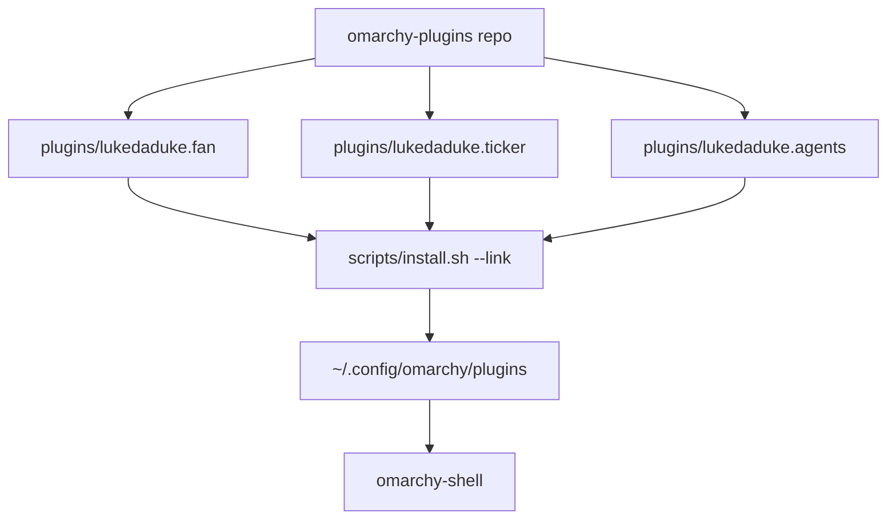

# Omarchy Plugins Marketplace - Plan

## Goal Capsule

- **Objective:** Create a local git repo `omarchy-plugins` that owns first-party Omarchy bar plugins, polish their UI and helper infra, and leave them installable for a later GitHub publish as `duketopceo/omarchy-plugins`.
- **Authority:** This plan. Omarchy plugin contract in `/usr/share/omarchy/shell/README.md`. INIT_PROTOCOL.md for repo scaffold. UX_FIRST.md for operator density and glanceable status. Session-settled decisions below.
- **Execution profile:** New local repo. No GitHub remote, no PR, no branch protection this run (`/lfg local`).
- **Stop conditions:** All units below meet Definition of Done. Do not vendor third-party marketplace clones. Do not create GitHub remotes or PRs. Do not rewrite the CLI zoo (`agy`, `ori`, `hermes`, …).
- **Tail ownership:** Local commits on `main`. Shipping tail stops at local git.

---

## Product Contract

### Summary

The live custom plugins sit as loose trees under `~/.config/omarchy/plugins/` with helpers on `PATH`. They mix Dracula hardcodes, host-absolute binaries, silent JSON failures, and unused stock forks. This product is a publishable first-party catalog: fan, ticker, and agents. Install is a symlink from the repo into Omarchy's plugin dir so hot-reload still works.

### Problem Frame

Omarchy treats a plugin as a git repo with `manifest.json` at the root. The current custom plugins are not git-backed, not theme-native, and not portable. Third-party clones already have remotes; republishing them as `duketopceo/*` would steal other authors' identity even when licenses allow forks.

### Requirements

**Catalog and install**

- R1. A local git repo exists at `Documents/github/personal/omarchy-plugins` with INIT_PROTOCOL scaffold (README, AGENTS.md, `.cursorrules`, `.gitignore`, LICENSE MIT).
- R2. The catalog contains exactly three plugins: `lukedaduke.fan`, `lukedaduke.ticker`, `lukedaduke.agents`.
- R3. Each plugin is a self-contained directory with `manifest.json` at its own root so it can later become its own git repo for `omarchy plugin add`.
- R4. `scripts/install.sh --link` symlinks those directories into `~/.config/omarchy/plugins/<id>` and rescans the shell. `--copy` is the non-dev path.
- R5. README documents later publish as `duketopceo/omarchy-plugins` and the one-repo-per-plugin Omarchy installer constraint.

**UI / UX**

- R6. Panels use Omarchy `Color` / `Style` tokens. No hardcoded Dracula hex (`#50fa7b`, `#ff5555`, `#ffb86c`, `#282a36`, `#1b4332`, `#4a151b`).
- R7. Status uses at most urgent / accent / muted / foreground. Green-vs-red market chips derive from `Color.accent` (up) and `Color.urgent` (down), not a private palette.
- R8. Every panel has an empty state, a fetch-error state, and a last-updated timestamp. Silent `catch (e) {}` is not an error UI.
- R9. Primary list actions are keyboard-reachable (`j`/`k` move, `Enter` activate, `Esc` close) where the panel already uses `KeyboardPanel`.
- R10. Bar buttons stay dense: one line, theme colors, tooltip carries the extra detail. Fan right-click still cycles fan mode.

**Infra**

- R11. Helper binaries live inside the plugin (`bin/`), invoked relative to the plugin dir, not `~/.local/bin/...`.
- R12. Fan mode control looks up `omarchy-fan-set` on PATH. If missing, the UI still shows stats and disables the mode buttons instead of calling a dead `/usr/local/bin` path.
- R13. Python helpers emit JSON with a stable schema and typed tests. No bare `except`.
- R14. `lukedaduke.agents` uses its own `moduleName` / `ipcTarget` (`lukedaduke.agents`), not the stock `omarchy.agents` ids.

### Actors

- A1. Laptop operator on Omarchy (Khan).
- A2. Future GitHub consumer installing from `duketopceo/omarchy-plugins`.

### Key Flows

- F1. Dev install
  - **Trigger:** Operator runs `scripts/install.sh --link`.
  - **Steps:** Backup any non-symlink plugin dir; symlink; `omarchy-shell shell rescanPlugins`.
  - **Outcome:** Bar widgets keep their `shell.json` ids and hot-reload from the repo.
- F2. Glance fan
  - **Trigger:** Operator looks at the bar, then opens the panel.
  - **Outcome:** RAM/CPU/temps/fan mode visible in <3s. Kill and mode actions work when helpers exist.
- F3. Glance ticker
  - **Trigger:** Operator opens ticker.
  - **Outcome:** Watchlist prices and signed change; click or Enter opens TradingView.

### Acceptance Examples

- AE1. Covers R6 / R7. Given a non-Dracula Omarchy theme, ticker up/down chips still read as up vs down using theme urgent/accent.
- AE2. Covers R8. Given a failed Yahoo fetch, ticker shows an error row and keeps the last good snapshot if any.
- AE3. Covers R4 / R11. After `--link`, `Panel.qml` does not reference `~/.local/bin/omarchy-finance-market-stats`.
- AE4. Covers R12. On a machine without `omarchy-fan-set`, fan panel still renders stats.

### Success Criteria

- `python -m pytest` in the repo passes.
- `scripts/validate-manifests.py` accepts all three manifests.
- `scripts/install.sh --link` leaves `~/.config/omarchy/plugins/lukedaduke.{fan,ticker,agents}` as symlinks into the repo.
- No Dracula hex remains in shipped QML.

### Scope Boundaries

**In**

- First-party fan, ticker, agents.
- Repo scaffold, install script, tests, theme/UX polish, helper relocation.

**Deferred for later**

- Creating the GitHub remote `duketopceo/omarchy-plugins` and splitting each plugin into its own repo.
- Third-party clone polish (`ai-usagebar`, tray, calendar, …). Updates would wipe local forks.
- `lukedaduke.tailscale` — unused clone; bar still uses `omarchy.tailscale`.
- Preview screenshots, AUR packages, GitHub Actions.
- CLI zoo cleanup (`agy`, `ori`, `hermes`, mise tools).

**Outside this product's identity**

- Editing `/usr/share/omarchy/`.
- Publishing other authors' plugins under `duketopceo`.

### Sources

- Omarchy plugin contract: `shell/README.md` (a plugin is a git repo with root `manifest.json`).
- Stock tokens: `shell/Commons/Color.qml`.
- Stock panel patterns: `shell/plugins/panels/monitor/Panel.qml`, `shell/plugins/agents/Panel.qml`.
- Live bar layout: `~/.config/omarchy/shell.json` (`lukedaduke.ticker`, `lukedaduke.fan` on the right; agents plugin unused on the bar; `akitaonrails.ai-usagebar` is the usage widget).

---

## Planning Contract

### Key Technical Decisions

- KTD1. Umbrella repo with `plugins/<id>/`, not four GitHub remotes this run. `(session-settled: user-directed — chosen over stuffing into an existing repo: user asked for duketopceo/omarchy-plugins and /lfg local, so the GitHub remote waits.)` Omarchy's `plugin add` clones a whole repo; the umbrella is the authoring/catalog home. `install.sh` is the local installer. Later publish can sparse-split.
- KTD2. First-party only: fan, ticker, agents. `(unlabeled inference, not session-settled)` Publishing MIT clones of other authors as `lukedaduke.*` is the wrong identity even when legal. Tailscale clone is unused and out.
- KTD3. Live plugins become symlinks into the repo (`--link`). Copy mode exists for machines that should not follow the working tree.
- KTD4. No shared QML module across plugins. Omarchy loads each plugin from its own directory; a sibling `shared/` import is not on the QML import path. Theme via `qs.Commons` only.
- KTD5. Helpers ship inside `plugins/<id>/bin/` and are invoked with `Qt.resolvedUrl` / plugin dir, not `$HOME/.local/bin`. Leave the old `~/.local/bin` copies in place this run (don't delete the operator's PATH) but stop calling them.
- KTD6. Agents stays a fork of stock `omarchy.agents` with extra providers (cursor, devin, factory, openrouter, agy, …). Fix ids to `lukedaduke.agents`. Do not force it onto the bar (usagebar already occupies that slot).
- KTD7. Local LFG: init + feature may land as sequential local commits on `main`. No `gh repo create`, no PR, no branch protection. INIT_PROTOCOL steps 8 (protection) and tracking issue are deferred.

### High-Level Technical Design



### Assumptions

- `omarchy-shell shell rescanPlugins` is available without sudo.
- `omarchy-fan-set` may be absent; fan stats still work from `/sys`.
- Yahoo chart API remains the ticker source this run (same as current helper).
- Workspace home is the operator machine; live symlink install is intended.

### Sequencing

U1 scaffold → U2 install/validate → U3 fan → U4 ticker → U5 agents → U6 docs/tests glue.

---

## Output Structure

```
omarchy-plugins/
  README.md
  AGENTS.md
  LICENSE
  .cursorrules
  .gitignore
  .env.example
  catalog.json
  scripts/
    install.sh
    validate-manifests.py
  plugins/
    lukedaduke.fan/
    lukedaduke.ticker/
    lukedaduke.agents/
  tests/
    test_fan_stats.py
    test_ticker_stats.py
    test_manifests.py
  docs/plans/
```

---

## Implementation Units

### U1. Repo scaffold

- **Goal:** INIT_PROTOCOL files and empty plugin dirs so later units have a home.
- **Requirements:** R1
- **Dependencies:** none
- **Files:** `README.md`, `AGENTS.md`, `.cursorrules`, `.gitignore`, `.env.example`, `LICENSE`, `catalog.json`
- **Approach:** Copy `.cursorrules` from luke-agents. README follows INIT_PROTOCOL headings. `.env.example` can be a one-line "no secrets required". `catalog.json` lists the three plugin ids, versions, and kinds.
- **Test scenarios:** Test expectation: none -- scaffold files. Presence is verified by later manifest tests.
- **Verification:** Files exist; git can be initialized.

### U2. Installer and manifest validator

- **Goal:** Deterministic link/copy install and schema check.
- **Requirements:** R3, R4, R5
- **Dependencies:** U1
- **Files:** `scripts/install.sh`, `scripts/validate-manifests.py`, `tests/test_manifests.py`
- **Approach:**
  1. Validate each `plugins/*/manifest.json` has `schemaVersion`, `id` matching directory name, `name`, `version`, `author`, `kinds`, `entryPoints`.
  2. `--link` replaces a real directory with a symlink only after copying it to `*.bak.<timestamp>` if it is not already the correct symlink.
  3. Call `omarchy-shell shell rescanPlugins` when the binary exists; do not fail the script if the shell is not running.
- **Test scenarios:**
  - Happy: validator accepts the three shipped manifests.
  - Edge: validator rejects a manifest whose `id` does not match the folder name.
  - Error: missing `entryPoints` fails non-zero.
- **Verification:** `python -m pytest tests/test_manifests.py` plus a dry-run of install against a temp dir.
- **Execution note:** This is packaging; prefer script/runtime smoke over heavy fixtures.

### U3. Fan plugin polish

- **Goal:** Portable fan/resource panel using theme tokens and in-plugin helpers.
- **Requirements:** R2, R6, R8, R9, R10, R11, R12, R13
- **Dependencies:** U1
- **Files:** `plugins/lukedaduke.fan/**`, `tests/test_fan_stats.py`
- **Approach:** Import current `Panel.qml` + `BarWidget.qml` + `manifest.json`. Move `omarchy-system-monitor-stats` and `omarchy-kill-proc` into `plugins/lukedaduke.fan/bin/`. Resolve helper path from the plugin directory. Replace hex colors with `Color.urgent` / `Color.accent` / `Color.muted`. Show error text when JSON parse fails. If `omarchy-fan-set` is missing, keep stats and disable mode cycling. Keyboard: `j`/`k` on process lists, `x` or `Enter` to kill selected (confirm with existing kill helper). Author `lukedaduke`. README in the plugin dir.
- **Patterns to follow:** Stock `omarchy.monitor` panel (tokens, KeyboardPanel). `soup.airpods/bin` for in-plugin binaries.
- **Test scenarios:**
  - Happy: stats helper prints JSON with `mem_pct`, `cpu_load`, `cpu_temp` keys and numeric bounds 0–100 for percents.
  - Edge: empty `/sys` readings still produce valid JSON with `"--"` temps.
  - Error: kill helper refuses pid <= 1.
- **Verification:** pytest for helpers; visual: panel opens after link install.

### U4. Ticker plugin polish

- **Goal:** Theme-native market panel with real error states.
- **Requirements:** R2, R6, R7, R8, R9, R10, R11, R13
- **Dependencies:** U1
- **Files:** `plugins/lukedaduke.ticker/**`, `tests/test_ticker_stats.py`
- **Approach:** Move `omarchy-finance-market-stats` into `plugins/lukedaduke.ticker/bin/`. Keep the watchlist. On HTTP failure return `{ "ok": false, "error": "...", "items": [] }` instead of crashing. QML shows error + last snapshot. Up/down chips use `Color.accent` and `Color.urgent` with translucent fills from `Qt.rgba`. `j`/`k`/`Enter` to open TradingView for the selected row. Drop hardcoded 10px fonts in favor of `Style.font` scales.
- **Test scenarios:**
  - Happy: helper with a mocked payload maps `regularMarketPrice` and `regularMarketChangePercent` into `items[].price` / `change` / `positive`.
  - Edge: empty items array is valid JSON `ok: true`.
  - Error: network failure path returns `ok: false` and non-empty `error`.
- **Verification:** pytest with mocked `urllib`; panel opens after link install.

### U5. Agents plugin identity + theme pass

- **Goal:** Keep the extra-provider fork, stop impersonating `omarchy.agents`.
- **Requirements:** R2, R6, R14
- **Dependencies:** U1
- **Files:** `plugins/lukedaduke.agents/**`
- **Approach:** Copy the current fork. Set `moduleName` and `ipcTarget` to `lukedaduke.agents`. Manifest author `lukedaduke`, description lists extra providers. Do not add the widget to `shell.json` (usagebar already there). Theme tokens already mostly correct; sweep remaining hex if any. Extra SVGs stay.
- **Test scenarios:** Test expectation: none for QML — assert via `test_manifests.py` that id is `lukedaduke.agents` and `Panel.qml` contains `lukedaduke.agents` not `omarchy.agents` as moduleName.
- **Verification:** grep clean for `moduleName: "omarchy.agents"` in the shipped plugin.

### U6. Root docs, catalog, and live link

- **Goal:** Operator can install and understand publish-later.
- **Requirements:** R4, R5
- **Dependencies:** U2, U3, U4, U5
- **Files:** `README.md` (update), `catalog.json`, `CONTRIBUTING.md` optional
- **Approach:** Run `scripts/install.sh --link` on this machine. README Local Setup is the link command. Deploy section: "not published yet; later `gh repo create duketopceo/omarchy-plugins`".
- **Test scenarios:** After install, `readlink` of the three plugin dirs points inside this repo.
- **Verification:** `test -L ~/.config/omarchy/plugins/lukedaduke.fan` (and ticker, agents).

---

## Verification Contract

| Gate | Command | Proves |
|---|---|---|
| Manifests | `python -m pytest tests/test_manifests.py` | R3 |
| Fan helper | `python -m pytest tests/test_fan_stats.py` | R13 |
| Ticker helper | `python -m pytest tests/test_ticker_stats.py` | R8, R13 |
| Hex sweep | `rg -n '#[0-9a-fA-F]{6}' plugins --glob '*.qml'` empty of Dracula values | R6 |
| Live link | `scripts/install.sh --link` then `readlink` the three dirs | R4 |
| Agents id | `rg 'moduleName: "omarchy.agents"' plugins/lukedaduke.agents` empty | R14 |

No browser tests. These are Quickshell panels, not a web app. `ce-test-browser` is N/A.

---

## Definition of Done

- Three plugins live in the repo with tests and theme-native QML.
- Installer links them on this machine.
- Local git has commits. No origin.
- Abandoned-attempt files are gone.
- `/tmp/claude_code_output.md` handoff written at session end.

---

## Risks & Dependencies

- Yahoo chart endpoints fail often; error UI (R8) is the mitigation, not a new data vendor this run.
- `omarchy-fan-set` is host-specific sudo. Disable, don't crash.
- Symlink install replaces the current plugin trees. Installer must backup non-symlink dirs first.
- Agents fork will drift from stock `omarchy.agents` on Omarchy updates. Document that in the plugin README.
