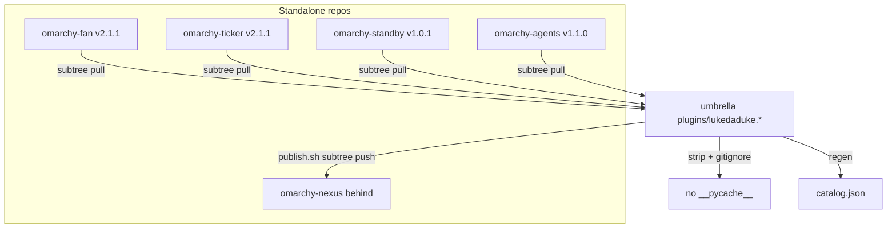

# Reconcile Umbrella Plugins With Standalone Repos - Plan

## Goal Capsule

- **Objective:** The `omarchy-plugins` umbrella repo is again the accurate source of truth for all five `lukedaduke.*` plugins: `plugins/<id>/` contents match what is actually published (or supersede it, for nexus), the catalog lists every plugin at its real version, and no tracked bytecode or stale docs contradict that.
- **Authority:** This plan. `AGENTS.md` ("source of truth for `lukedaduke.*` plugins"), `docs/UPSTREAM.md` (umbrella authors, public per-plugin repos ship), `scripts/publish.sh` (subtree push is the publish mechanism).
- **Execution profile:** Branch off `main` in this repo, land changes via PR. The nexus push-out to `duketopceo/omarchy-nexus` happens via the existing `scripts/publish.sh` subtree-push flow (direct push to that repo's `main` is the established mechanism, not part of the umbrella PR).
- **Stop conditions:** `diff -r plugins/lukedaduke.<x>` vs each standalone `main` is empty for fan/ticker/standby/agents, and for nexus once U2's push lands. `scripts/validate-manifests.py` clean. No `*.pyc`/`__pycache__` tracked.

---

## Product Contract

### Summary

The five standalone plugin repos were published from this umbrella via `git subtree` splits, then received direct fixes during Omarchy marketplace security review (fan v2.1.1 control-file hardening, ticker v2.1.1 response byte-budget, standby v1.0.1 HTTPS-only + `Text.PlainText`, agents gained `preview.png`). Those fixes never came back to the umbrella, which still documents itself as source of truth. Meanwhile the umbrella moved ahead on nexus (`BarIconButton` button simplification, unpublished) and `catalog.json` drifted (nexus missing entirely; three stale versions). The result: two sources of truth disagreeing in both directions, plus `__pycache__` tracked in two standalone repos that would be re-imported on any sync.

### Problem Frame

`AGENTS.md` declares the umbrella the source of truth and `publish.sh` pushes plugin dirs outward — but the mechanism only flows one way. Marketplace review fixes landed on the standalone repos directly (HANCORE-flagged security issues had to be fixed at the reviewed SHA). Without a reconciliation pass, the next `publish.sh` push from the umbrella would silently revert the marketplace-approved security fixes — the exact failure this plan prevents.

### Requirements

**Sync in (standalone ahead)**

- R1. `plugins/lukedaduke.fan/` content equals `omarchy-fan@main` (v2.1.1: `XDG_RUNTIME_DIR` control dir `0700`, `0600` `O_NOFOLLOW` control file, fstat owner/regular-file checks in `bin/omarchy-fan-daemon` + `bin/omarchy-fan-set`).
- R2. `plugins/lukedaduke.ticker/` content equals `omarchy-ticker@main` (v2.1.1: `MAX_RESPONSE_BYTES` 1 MiB budget, `Content-Length`/`Content-Type` rejection in `bin/market_stats.py`).
- R3. `plugins/lukedaduke.standby/` content equals `omarchy-standby@main` (v1.0.1: HTTPS-only redirect handler, response byte cap, coerced/truncated location strings, `Text.PlainText` sinks, no cross-plugin `market_stats.py` exec).
- R4. `plugins/lukedaduke.agents/` gains `preview.png` from `omarchy-agents@main` (versions already match at 1.1.0).

**Sync out (umbrella ahead)**

- R5. `plugins/lukedaduke.nexus/` (the `BarIconButton` simplification) is pushed to `duketopceo/omarchy-nexus` via `scripts/publish.sh nexus`, so the standalone repo is no longer behind.

**Hygiene and metadata**

- R6. No `__pycache__/` or `*.pyc` is tracked anywhere under `plugins/`; `.gitignore` prevents recurrence. Synced-in standalone bytecode files are stripped in the same change.
- R7. `catalog.json` lists all five plugins including `lukedaduke.nexus`, with versions matching each plugin's `manifest.json` (fan/ticker 2.1.1, standby 1.0.1, agents 1.1.0, nexus 1.0.0).
- R8. `docs/UPSTREAM.md` no longer claims the umbrella "stays private" — the repo is public; the doc's remaining constraint is that `machine/` never goes into the public per-plugin repos.

### Scope Boundaries

**Deferred to Follow-Up Work**

- Resubmitting nexus/port-forward to the marketplace (tracked as omarchy-plugins#7).
- Removing tracked `__pycache__` from the standalone repos is accomplished implicitly by the next `publish.sh` push per plugin — verified in Verification Contract, not a separate PR per repo.
- Deleting stale local `publish/*` branches on the other workstation (omarchy-plugins#4) — machine-local cleanup, not repo state.

**Outside this product's identity**

- No new plugin features, no QML/UI changes beyond what the standalone repos already contain.
- No changes to `machine/` (stays umbrella-only per `docs/UPSTREAM.md`).

---

## Planning Contract

### Key Technical Decisions

- KTD1. **Sync direction is per-plugin, not global.** fan/ticker/standby/agents pull remote→umbrella; nexus pushes umbrella→remote. A blanket direction either reverts marketplace security fixes or loses the nexus refactor. Grounded in the measured drift map (fan/ticker/standby remote-ahead by security commits; agents remote-ahead by `preview.png`; nexus umbrella-ahead by `BarIconButton`).
- KTD2. **`git subtree pull --prefix=plugins/<id> <repo> main` for the four inbound plugins**, the exact inverse of `scripts/publish.sh`'s `subtree push`. Standalone histories already contain the umbrella's split SHAs (e.g. `c9aa394` in both), so the pull merges real history instead of fabricating file snapshots — future `subtree push` stays well-formed. Rejected alternative: copy files over the dirs — simpler but severs the split-hash lineage every future publish depends on.
- KTD3. **Strip synced bytecode inside the PR, don't try to exclude it mid-pull.** `omarchy-fan`/`omarchy-ticker` track `bin/__pycache__/*.pyc`; the subtree pull will carry them in. They are deleted in the umbrella tree and covered by `.gitignore`; the next publish per plugin propagates the deletion outward.
- KTD4. **`catalog.json` is regenerated from `plugins/*/manifest.json` values**, not hand-edited versions — the file already drifted once because nothing ties it to the manifests.

### Assumptions

- `git subtree` is available on the executor's git (ships with git ≥2.x as `git-subtree`); if missing, `pacman -S git subtree` equivalent or per-file copy with an explicit squash-merge note in the PR body.
- The four standalone `main` branches do not move during the run; if they do, re-fetch and reconcile to the newer SHA.
- The live bar install is a symlink into this repo (per `AGENTS.md`); synced code lands on the laptop bar immediately on merge — acceptable because the inbound content is what already runs via the standalone-published installs.

### High-Level Technical Design

---

## Implementation Units

### U1. Inbound subtree sync for fan, ticker, standby, agents

**Goal:** `plugins/` dirs carry the marketplace-reviewed code.

**Requirements:** R1, R2, R3, R4

**Files:** `plugins/lukedaduke.fan/`, `plugins/lukedaduke.ticker/`, `plugins/lukedaduke.standby/`, `plugins/lukedaduke.agents/` (all synced paths)

**Approach:**

1. For each of `fan`, `ticker`, `standby`, `agents`: `git subtree pull --prefix=plugins/lukedaduke.
 git@github.com:duketopceo/omarchy-
.git main --squash` — squash keeps umbrella history readable; each pull is its own commit.
2. If a pull conflicts (unlikely: umbrella dirs are strict subsets of remote history), resolve by taking the standalone repo's content wholesale — it is the reviewed code.
3. Verify with `diff -r` against a fresh `git archive <remote> main` extraction per plugin.

**Patterns to follow:** `scripts/publish.sh` already encodes the repo map (`REPO` assoc array) and the subtree mechanism.

**Test scenarios:**

- After sync, extracting `git archive omarchy-fan@main` to a temp dir and running `diff -r` against `plugins/lukedaduke.fan/` reports only `bin/__pycache__/` extras (removed in U3).
- `grep runtime_dir plugins/lukedaduke.fan/bin/omarchy-fan-daemon` finds the `XDG_RUNTIME_DIR` path.
- `grep MAX_RESPONSE_BYTES plugins/lukedaduke.ticker/bin/market_stats.py` finds the 1 MiB budget.
- `grep HTTPSOnly plugins/lukedaduke.standby/bin/standby-data` finds the redirect policy; `grep -c "Text.PlainText" plugins/lukedaduke.standby/Standby.qml` > 0.
- `plugins/lukedaduke.agents/preview.png` exists.

**Verification:** Four merge commits land; diffs against remotes are empty except pending U3 removals.

### U2. Outbound nexus publish

**Goal:** `omarchy-nexus` standalone repo receives the umbrella-ahead `BarIconButton` refactor.

**Requirements:** R5

**Dependencies:** U1 (so the branch is current before pushing out)

**Files:** `plugins/lukedaduke.nexus/` (unchanged — this unit pushes, not edits); `scripts/publish.sh` (read-only use)

**Approach:**

1. Run `scripts/publish.sh nexus` — it does `git subtree push --prefix=plugins/lukedaduke.nexus git@github.com:duketopceo/omarchy-nexus.git main`.
2. If non-fast-forward (diverged remote), fetch the remote, `git subtree pull` nexus first to merge, then push.

**Test scenarios:**

- `git ls-remote omarchy-nexus main` SHA afterward equals the split of umbrella `plugins/lukedaduke.nexus`.
- `diff -r` of remote archive vs local dir is empty.

**Verification:** Remote `main` contains `BarIconButton` in `Panel.qml`; `manifest.json` still 1.0.0 (no version bump — the refactor predates any release tagging; bump is a separate publish decision).

### U3. Bytecode hygiene

**Goal:** No tracked `__pycache__`/`*.pyc` under `plugins/`; ignore rules prevent return.

**Requirements:** R6

**Dependencies:** U1 (pulls bytecode in)

**Files:** `.gitignore`, synced `plugins/lukedaduke.*/bin/__pycache__/` trees (deletions)

**Approach:**

1. `git rm -r --cached`-delete tracked `__pycache__`/`*.pyc` paths that U1 imported.
2. Ensure `.gitignore` covers `__pycache__/` and `*.pyc` (add if absent).

**Test scenarios:**

- `git ls-files | grep -c pycache` returns 0.
- `git status` shows no untracked `.pyc` churn after running helpers locally.

**Verification:** `git ls-files` clean of bytecode; `.gitignore` covers the patterns.

### U4. Catalog regen

**Goal:** `catalog.json` enumerates all five plugins at manifest-true versions.

**Requirements:** R7

**Dependencies:** U1 (versions arrive with the sync)

**Files:** `catalog.json`

**Approach:**

1. Add the missing `lukedaduke.nexus` entry (id, path `plugins/lukedaduke.nexus`, version from its `manifest.json`, kinds `["bar-widget"]`, repo URL) matching existing entry shape.
2. Bump fan/ticker to 2.1.1, standby to 1.0.1 — read each version from the synced `manifest.json`, not from memory.

**Test scenarios:**

- `jq` or python check: every `plugins/*/manifest.json` `id` appears in `catalog.json` with equal `version`.
- `scripts/validate-manifests.py` passes (manifest validity independent of catalog, but run it here anyway).

**Verification:** catalog↔manifest parity for all five entries.

### U5. Doc reality pass

**Goal:** `docs/UPSTREAM.md` and `AGENTS.md` stop contradicting the repo's actual state.

**Requirements:** R8

**Dependencies:** U1–U4 (docs describe the post-sync truth)

**Files:** `docs/UPSTREAM.md`, `AGENTS.md`

**Approach:**

1. `docs/UPSTREAM.md`: replace "This repo stays **private**" framing — the umbrella is public; keep and sharpen the real constraints (`machine/` never ships to per-plugin repos; marketplace requires per-plugin public repo with root `manifest.json`).
2. `AGENTS.md` "Active Issues / Known State": update the stale bullets (bar still uses `akitaonrails.ai-usagebar` — verify before rewriting) and add a one-line sync rule: inbound `subtree pull`, outbound `publish.sh`, run both before cutting releases.

**Test expectation: none** — docs only; the check is that no sentence contradicts repo state (public visibility, sync mechanism).

**Verification:** No doc claims the repo is private; publish flow documented bidirectionally.

---

## Verification Contract

| Gate | Command / check | Applies to |
|---|---|---|
| Manifest validity | `python3 scripts/validate-manifests.py` exits 0 | U1–U4 |
| Sync parity | `git archive <remote> main` extracted to a temp dir, then `diff -r` vs `plugins/lukedaduke.
` empty for fan/ticker/standby/agents; nexus empty after U2 push | U1, U2 |
| Bytecode | `git ls-files \| grep -c pycache` = 0 | U3 |
| Catalog parity | every `plugins/*/manifest.json` id+version appears in `catalog.json` | U4 |
| Install smoke | `scripts/install.sh --link` still resolves all five plugin dirs | U1 |

## Definition of Done

- All five U-IDs land on one PR branch against `main`; CI (if any checks exist on the repo) green.
- `plugins/` contents equal the standalone published state for fan/ticker/standby/agents, and nexus standalone equals umbrella state after U2's push.
- No tracked bytecode; `.gitignore` covers `__pycache__/`/`*.pyc`.
- `catalog.json` has five entries at true versions; `docs/UPSTREAM.md` + `AGENTS.md` consistent with public, bidirectional reality.
- No abandoned-attempt artifacts (failed subtree experiments, temp dirs) left in the diff.
