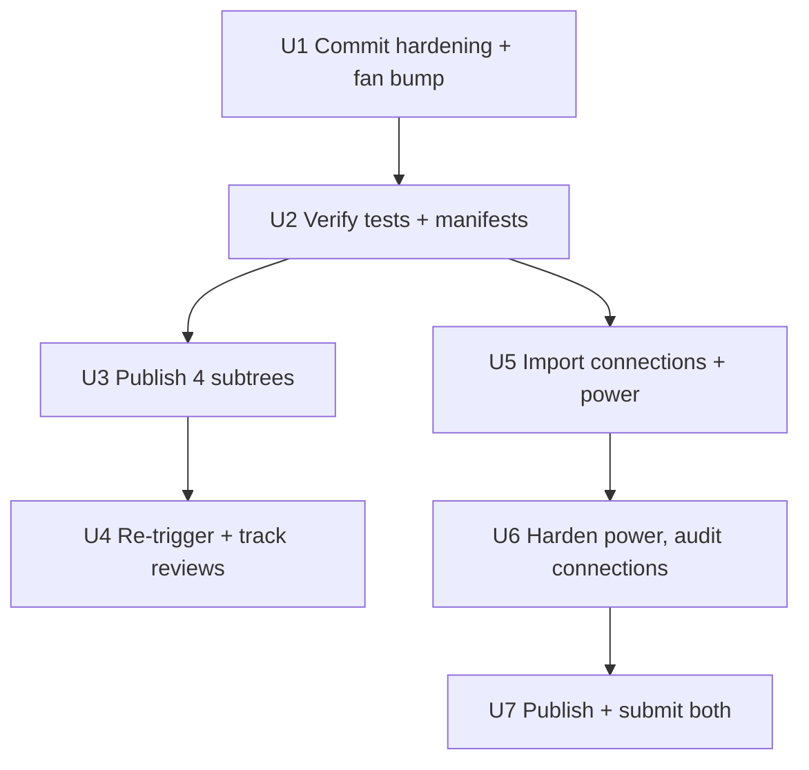

# Marketplace Security Round 2 - Plan

## Goal Capsule

- **Objective:** The five open `lukedaduke.*` marketplace tracks reach a verdict: fan, ticker, standby, and nexus submissions are re-validated on the committed round-2 hardening and driven to `listed` (or a recorded finding); `lukedaduke.connections` and `lukedaduke.power` join the catalog hardened and submitted. `lukedaduke.agents` is already listed — nothing owed there.
- **Authority:** This plan. `AGENTS.md` (umbrella is source of truth), `docs/UPSTREAM.md` (subtree publish/adopt model, issue-edit re-validation), `.devin/skills/omarchy-marketplace-submission/` (submission body contract), `docs/plans/2026-09-11-1927-fix-umbrella-standalone-drift-plan.md` (round-1 precedent).
- **Execution profile:** Commits land on `main` in the umbrella (established mechanism — direct commits, no PR flow in this repo). Standalone repos are updated only via `scripts/publish.sh` subtree push, never by editing them directly. Marketplace re-validation is triggered by editing an open submission issue; comments do not re-run validation. A submission that has moved to closed/listed instead uses the marketplace's verify-plugin form (newer-upstream-commit path).
- **Stop conditions:** `plugins/` tree is clean; `uv run --with pytest pytest -q` and `scripts/validate-manifests.py` pass; each published standalone `main` contains the umbrella's subtree tip; issues #4985, #4986, #4988, #6436 show a re-run of the security baseline against the new commits with a recorded outcome (listed, approved, or documented finding); connections and power have submission issues filed in the exact required format.

---

## Product Contract

### Summary

The marketplace security review (HANCORE-linux) flagged the same class of issue on all four open `lukedaduke.*` submissions: helpers launched through bare `python3` resolved from ambient `PATH`, inherited environment, unbounded stdout buffering, and no whole-job deadline — a persistent shell process that repeats the exec every few seconds. A hardening pass fixing exactly that (absolute `/usr/bin/python3`, fixed minimal env, byte caps, `SIGKILL` deadline timers, process-group kills) is already written but uncommitted in the working tree. Separately, two authored plugins — `lukedaduke.connections` (v1.0.0) and `lukedaduke.power` (v1.1.0) — live only in `~/.config/omarchy/plugins/` and were never imported into the catalog or submitted; `power` carries the same exec-boundary flaws plus a stock-IPC-namespace collision and must be hardened before it can survive review.

### Problem Frame

Round 1 (the drift-reconciliation plan) pulled marketplace-side fixes back into the umbrella and established the publish/adopt sync model. Round 2 is the next review wave: the fixes are written but unshipped, so the four open submissions still point at vulnerable commits. Meanwhile the catalog under-represents the authored surface — connections and power are real plugins that exist only on this laptop, which means they are neither versioned, published, nor listed. This plan finishes both: ship the hardening through the established publish path, drive the open submissions to a verdict, and bring the two orphaned plugins into the same pipeline — publishing power only *after* hardening so its first public commit is the clean one.

### Requirements

**Land and publish round-2 hardening**

- R1. The uncommitted hardening changes in `plugins/lukedaduke.{fan,ticker,standby,nexus}/` and `tests/` are committed to umbrella `main` with per-plugin commits.
- R2. `plugins/lukedaduke.fan/manifest.json` is bumped `2.1.2 -> 2.1.3` and `catalog.json` fan version matches (session-settled: keeps parity with the other three bumped plugins).
- R3. `uv run --with pytest pytest -q` (the README-documented runner; the suite is pytest-style, `unittest discover` collects zero tests) and `python3 scripts/validate-manifests.py` are green before any publish.
- R4. `scripts/publish.sh` pushes fan, ticker, standby, and nexus subtrees to their standalone `main` branches — and only those four (never `all`, which would also push `agents` and, later, unhardened `power`). Before each push, the standalone tip is verified contained in the umbrella split history; if a repo-side fix landed, the UPSTREAM.md adopt merge runs first so the publish never silently reverts remote-side review fixes.
- R5. Issues #4985 (fan), #4986 (ticker), #4988 (standby), and #6436 (nexus) on `omacom/omarchy-plugin-marketplace` are re-validated against the new commits — each issue's state checked first: open issues get a body edit (the documented re-trigger); any that moved to listed/closed get the verify-plugin form with the new tip SHA instead.
- R6. New reviewer findings beyond the current fixes are addressed in the umbrella and republished through the same loop; the loop terminates per issue on `listed`/`approved-and-verified`, a finding requiring a user decision, or maintainer silence — after ~3 days with no baseline/maintainer response, record "awaiting maintainer review at commit <sha>" as the issue's state and move on.

**Onboard connections and power**

- R7. `lukedaduke.connections` and `lukedaduke.power` are imported from `~/.config/omarchy/plugins/` into `plugins/` with a pre-import secrets/host-path scan, added to `catalog.json`, to the `REPO` map in `scripts/publish.sh` (usage string updated), to `machine/plugins.json`'s `first_party_from_this_repo` (adding `nexus` too — it is already missing), and to README's plugin tables.
- R8. Each gets a public standalone repo (`duketopceo/omarchy-connections`, `duketopceo/omarchy-power`) created via `gh repo create`, populated by subtree push — `connections` after import, `power` only after its hardening lands, so its first public commit is the hardened one.
- R9. `power`'s exec surface is hardened to the round-2 standard before publication — all six `Process` blocks (including `actionProc` running `omarchy-powerprofiles-set` and the always-on 60s `samplerProc`), with a fixed env that retains `HOME`/`XDG_STATE_HOME` because `omarchy-powerprofiles-set` persists profile choice under `$HOME/.local/state/omarchy/powerprofiles` and `battery_helper.py` writes `~/.local/state/omarchy/battery_history.json`. `connections` gets a full audit (exec surface plus non-exec items: its `/usr/share/omarchy` panel-path dependency documented, manifest `license` parity).
- R10. Submission issues for connections and power are opened in the exact six-heading format from the submission skill, with category/tags from the allowed lists.
- R11. Each new plugin dir carries `LICENSE` (MIT, sibling parity) and `README.md` with install/remove instructions before its first publish — the submission checklist attests to both.

### Success Criteria

- The four round-2 submissions are `listed`, `approved-and-verified`, or carry a recorded outcome ("awaiting maintainer at sha X" / documented finding); any new findings land back in the umbrella, not on standalone repos directly.
- `omarchy plugin validate` passes on a fresh clone of each new standalone repo.
- The umbrella remains the source of truth: no standalone repo receives commits outside the `publish.sh`/adopt flow, and no publish reverts unadopted remote-side fixes.
- `omarchy.power`'s IPC-target decision (keep `omarchy.power` shim vs. rename to `lukedaduke.power`) is made deliberately before submission, not discovered mid-review.

### Scope Boundaries

- `lukedaduke.agents` is already marketplace-listed (#4987, approved-and-verified) — in the tree and catalog, out of this round's submission work.
- `lukedaduke.tailscale` stays excluded (stock clone, per `AGENTS.md`).
- OmaSeal (#5620) and dayflow (#4992) submissions are out of scope — different repos, owned by other work tracks.
- No vendoring of third-party plugins.
- No plugin behavior/feature changes beyond the security hardening standard.

### Deferred to Follow-Up Work

- Umbrella CI workflow (`.github/workflows/ci.yml` running pytest + manifest validation) — worthwhile repo hygiene, but nothing in the marketplace objective depends on it.
- Re-submitting or fixing the OmaSeal/dayflow security-review-required submissions (repo-owner track).
- `power`'s `samplerProc` always-on 60s sampling pattern — hardened exec mitigates the flagged vectors, but the persistent pattern itself may draw a capability note in review.
- `connections`' dependency on `/usr/share/omarchy/shell/plugins/panels/` internals — document in README/submission notes; a rewrite is out of scope.

### Open Questions

- **`power` IPC namespace.** `power`'s `IpcHandler` targets `omarchy.power` — the stock plugin's namespace, enabled in the default bar layout (`machine/bar-layout.json`). Keeping it preserves omarchy-CLI keybinding compatibility but collides if both plugins load and may read as namespace squatting to a reviewer. Default: keep, documented in the submission's Maintainer notes; escalate to the user if the reviewer objects.
- **`gh` repo-creation scope.** Issue listing/viewing is verified; `gh repo create` rights are assumed — first `gh repo create` in U5 is the live check.

---

## Planning Contract

### Key Technical Decisions

- KTD1. **Marketplace loop drives to verdict, not just publish** (session-settled: user-approved — chosen over stopping at subtree push: the goal is listed plugins, and the issues stall at `validated` without a re-trigger). Governs R5, R6.
- KTD2. **Connections and power are imported now** (session-settled: user-approved — chosen over leaving them local-only: release-stage means versioned, published, and submitted like the rest). Governs R7–R11.
- KTD3. **Fan bumped to 2.1.3** (session-settled: user-approved — chosen over leaving 2.1.2: code changed post-release, siblings were bumped). Governs R2.
- KTD4. **One hardening pattern, applied everywhere — with an env caveat.** The in-tree changes define the standard: absolute `/usr/bin/python3` and `/usr/bin/omarchy-*` tool paths (never PATH-resolved), `clearEnvironment` + fixed minimal env, stdout byte caps, whole-job deadline `Timer` that `signal(9)`s, and process-group kills in helpers. For `power` the minimal env keeps `HOME` (and `XDG_STATE_HOME` where set) — dropping it silently breaks profile persistence (see R9). Note: `Quickshell.execDetached` takes no env parameter, so detached helpers run with ambient env; the absolute argv[0] is what constrains them, and helpers that spawn subprocesses must self-scrub (the `probe_nexus.py` `_run`/`SAFE_ENV` pattern).
- KTD5. **Re-validation via issue edit — open issues only.** `docs/UPSTREAM.md` documents that editing a submission issue re-runs validation while comments do not; that mechanism applies only while the issue is open. If a submission is listed/closed, the verify-plugin form (newer-upstream-commit path) is the re-validation route.
- KTD6. **Standalone repos never edited directly.** All plugin changes land in the umbrella and flow out via `scripts/publish.sh`; marketplace-side fixes come home through the adopt merge in `docs/UPSTREAM.md`, not by editing standalone repos.
- KTD7. **Publish is never fire-and-forget into divergence.** `publish.sh`'s reconcile path (`commit-tree split^{tree} -p remote-tip`) produces a tip whose tree is entirely the umbrella's — correct only when the remote side has nothing unadopted. The pre-flight containment check (R4) is the guard; on divergence, adopt first, then push.

### Assumptions

- `gh` is authenticated with issue-edit and repo-creation rights (issue listing verified during planning; repo create is checked live in U5).
- The uncommitted tree is complete and correct as written — verified at review level during planning; the pytest run is the first execution gate.
- `connections` has no exec/subprocess surface (grep found none; U6's audit is the confirmation pass).
- Issues #4985/#4986/#4988/#6436 were open with `validated` at planning time; U4 re-checks state before choosing the re-trigger mechanism.

### Sequencing

U4 is a tracking loop, not a code gate — U5–U7 do not wait on it. `power`'s first public push is deliberately inside U6→U7, after hardening.

---

## Implementation Units

### U1. Commit round-2 hardening; bump fan

**Goal:** Land the working-tree security fixes on `main` as per-plugin commits.

**Requirements:** R1, R2

**Files:**
- `plugins/lukedaduke.fan/` (Panel.qml, bin/kill_proc.py, bin/omarchy-fan-daemon, bin/omarchy-fan-set, manifest.json version bump — check `bin/system_monitor_stats.py` for uncommitted changes too; it is the recurring exec target)
- `plugins/lukedaduke.ticker/` (Panel.qml, manifest.json)
- `plugins/lukedaduke.standby/` (Standby.qml, bin/standby-data, manifest.json)
- `plugins/lukedaduke.nexus/` (Panel.qml, bin/probe_nexus.py, manifest.json)
- `tests/test_ticker_stats.py`
- `catalog.json` (fan version)

**Approach:**
1. Bump fan manifest `2.1.2 -> 2.1.3`; update `catalog.json` fan version to match.
2. Commit per plugin (fan, ticker, standby, nexus) plus the test update — messages in the repo's conventional style, noting the marketplace-review driver.
3. Do not commit `__pycache__`/`*.pyc` (`.gitignore` covers them; verify nothing slipped in).

**Patterns to follow:** commit style from `git log` (`sync: adopt omarchy-ticker publish commit`, etc.); the drift plan's per-plugin separation.

**Test expectation: none** — behavior verification is U2; this unit is landing already-written changes.

**Verification:** `git status` clean except ignored files; `git log` shows one commit per plugin.

### U2. Verify suite and manifests

**Goal:** Prove the committed state passes the repo's own gates before anything is pushed.

**Requirements:** R3

**Dependencies:** U1

**Files:** `tests/`, `scripts/validate-manifests.py` (run only)

**Approach:**
- Run `uv run --with pytest pytest -q` (README-documented runner — the suite is pytest-style function tests; `python3 -m unittest discover` collects zero TestCases and exits 0 vacuously, so it must not be used anywhere) and `python3 scripts/validate-manifests.py`.
- Any failure is fixed in the umbrella before publishing — never fix forward on a standalone repo.

**Test scenarios:**
- pytest reports all tests passing across `test_fan_stats.py`, `test_ticker_stats.py`, `test_manifests.py` (10 test functions total today; more after U5 if manifest tests enumerate plugins).
- `validate-manifests.py` prints `ok: 5 manifests` before U5's imports and `ok: 7 manifests` after (five existing dirs — fan, ticker, agents, standby, nexus — plus connections and power).

**Verification:** both commands exit 0 with the real counts, not vacuous passes.

### U3. Publish the four subtrees

**Goal:** Standalone repos carry the hardened code — and nothing they shouldn't lose.

**Requirements:** R4

**Dependencies:** U2

**Files:** `scripts/publish.sh` (run only)

**Approach:**
1. Pre-flight per plugin: `git fetch` the standalone `main` and confirm its tip is contained in the umbrella's split history (`git subtree split`/`merge-base` check). If the remote has unadopted commits, run the UPSTREAM.md adopt merge first — the reconcile path would otherwise drop them from the tip.
2. Run `scripts/publish.sh` individually for fan, ticker, standby, nexus — never `all` (it iterates the full REPO map including `agents` and, post-U5, unhardened `power`).
3. After each push, confirm the standalone `main` tip tree equals `plugins/lukedaduke.<id>/`.

**Test expectation: none** — publish mechanics are verified by tree equality, not tests.

**Verification:** for each of the four, remote tip's tree matches the local subtree; no remote-side commits were dropped (reconcile path used only after containment confirmed).

### U4. Re-trigger and track marketplace reviews

**Goal:** The four open submissions re-validate against the new commits and reach a verdict.

**Requirements:** R5, R6

**Dependencies:** U3

**Files:** none (external issue tracker only)

**Approach:**
1. For each of #4985, #4986, #4988, #6436: check current state first. Still-open → edit the issue body to re-run validation (per UPSTREAM.md / submission skill). Closed or listed → use the marketplace's verify-plugin form with the new tip SHA (a listed plugin's snapshot otherwise stays on the vulnerable commit while the issue sits closed).
2. Track the Automated Security Baseline result on each; if `needs-fixes` or a new finding appears, route the fix through U1→U3 again (umbrella first).
3. Loop ends per issue on `listed`/`approved-and-verified`, a finding needing a user decision, or maintainer silence — after ~3 days without baseline/maintainer response, record "awaiting maintainer review at commit <sha>" on the issue and in the plan's open items.

**Test expectation: none** — external review loop.

**Verification:** each issue carries a recorded terminal-or-pending state; nothing sits unaddressed without a note.

### U5. Import connections and power into the umbrella

**Goal:** Both plugins become catalog citizens — scanned, documented, registered — with only `connections` pushed so far.

**Requirements:** R7, R8 (partially — `power`'s repo is created but its first push waits for U6), R11

**Dependencies:** U2 (so imports land on a verified tree)

**Files:**
- `plugins/lukedaduke.connections/` (new — copy from `~/.config/omarchy/plugins/lukedaduke.connections`)
- `plugins/lukedaduke.power/` (new — copy from `~/.config/omarchy/plugins/lukedaduke.power`)
- `catalog.json`
- `scripts/publish.sh` (`REPO` map + usage string: `connections`, `power`)
- `machine/plugins.json` (`first_party_from_this_repo` — add both plus missing `nexus`)
- `README.md` (plugin/deploy tables)

**Approach:**
1. Copy each plugin dir into `plugins/`; drop `__pycache__`/`.pyc`.
2. Pre-publication scan on both dirs: `grep -rniE '(token|secret|api[_-]?key|password|/home/)'` plus a dotfiles check (`.env*`, `.git`, `.envrc`) — publishing is permanent; this is the last cheap gate.
3. Author `LICENSE` (MIT — copy a sibling's, e.g. `plugins/lukedaduke.fan/LICENSE`) and `README.md` with install/remove sections inside each new plugin dir; add `"license": "MIT"` to both manifests for sibling parity.
4. Add catalog entries (id, path, manifest version, kinds, repo URL); add both to `publish.sh`'s `REPO` map and usage string; update `machine/plugins.json` and README tables.
5. `gh repo create duketopceo/omarchy-connections --public` and `duketopceo/omarchy-power --public` — empty, no template files.
6. Push `connections` now (`scripts/publish.sh connections`). Do **not** push `power` — its first public commit is the hardened tree in U6.

**Patterns to follow:** existing `plugins/lukedaduke.*/` layout; `catalog.json` entry shape; sibling LICENSE/README files.

**Test scenarios:**
- `validate-manifests.py` reports `ok: 7 manifests` with folder-id/id match holding for both new dirs.
- `test_manifests.py` passes (confirm whether it enumerates plugins — adjust expected count if so).
- Secrets scan output is empty for both new dirs.

**Verification:** `validate-manifests.py` ok × 7; both repos created; `omarchy-connections` tip tree equals `plugins/lukedaduke.connections/`; `omarchy-power` exists but is still empty.

### U6. Harden power, audit connections, publish power

**Goal:** `power` meets the round-2 standard and its first public commit is the hardened tree; `connections` is confirmed clean.

**Requirements:** R9

**Dependencies:** U5

**Files:**
- `plugins/lukedaduke.power/Panel.qml` — all six `Process` blocks: `batteryProc`, `profilesProc`, `systemProc`, `powerDataProc`, `actionProc` (`omarchy-powerprofiles-set`, the write-path), `samplerProc` (60s `battery_helper.py --sample`)
- `plugins/lukedaduke.power/battery_helper.py` — it shells out (`subprocess.run(["ps", ...])`), so it gets the `probe_nexus.py` `_run`/`_kill_tree` treatment
- `plugins/lukedaduke.power/manifest.json` — bump `1.1.0 -> 1.1.1` for the hardening change
- `catalog.json` — power version sync
- `plugins/lukedaduke.connections/BarWidget.qml` — audit read; harden only if exec surface exists

**Approach:**
1. Port the KTD4 pattern to `power`: absolute `/usr/bin/python3` and `/usr/bin/omarchy-*` tool paths, `clearEnvironment` + fixed env **retaining `HOME`/`XDG_STATE_HOME`** (see R9 — `omarchy-powerprofiles-set` persists under `$HOME/.local/state/omarchy/powerprofiles`; dropping HOME breaks it), byte caps, deadline timers on every `Process`, `onExited` handlers stopping them.
2. `battery_helper.py`: apply `SAFE_ENV`/`_run`/`_kill_tree` so its `ps` call is absolute-path, capped, and deadline-bound.
3. Bump `power` manifest to 1.1.1; sync `catalog.json`.
4. `connections` audit: read `BarWidget.qml` fully — confirm no `Process`/`execDetached`; document the `/usr/share/omarchy` panel-path dependency in its README and future submission's Maintainer notes; add manifest `license` field if missed in U5.
5. Publish: `scripts/publish.sh power` — the standalone repo's first commit is the hardened tree.

**Patterns to follow:** the exact diff shape of the round-2 `Panel.qml` changes (procEnv object, deadline Timer, `clearEnvironment`); `probe_nexus.py`'s `_run`/`_kill_tree` for the helper.

**Test scenarios:**
- QML review checklist per file: no bare `python3`/`bash`/`rm`/unqualified `omarchy-*` in `command:` or `execDetached` args; every `Process` has `clearEnvironment` + fixed env (with HOME for power) and a deadline timer; every stdout collector has a byte cap.
- `battery_helper.py` runs under SAFE_ENV with absolute `ps` path and per-call deadline.
- Manifest validates; catalog version matches 1.1.1.

**Verification:** audit checklist clean for both plugins; `omarchy-power` tip tree equals `plugins/lukedaduke.power/` **after** hardening.

### U7. Submit connections and power

**Goal:** Both have marketplace submission issues in the required format.

**Requirements:** R10

**Dependencies:** U5, U6, and a successful `omarchy plugin validate` on each standalone repo clone

**Approach:**
1. Fetch the live `SUBMISSION.md` from `omacom/omarchy-plugin-marketplace` first (the skill's cached rules defer to it).
2. Build each issue body with the exact six headings/order from `.devin/skills/omarchy-marketplace-submission/SKILL.md`; choose category/tags from the allowed lists (likely `Hardware`/`Widgets` + `bar`, `system`, `power-management` for power; `System`/`Widgets` + `bar`, `system` for connections — confirm against the live allowed list). Maintainer notes: document connections' `/usr/share/omarchy` panel dependency and power's `omarchy.power` IPC-target decision (per Open Questions).
3. `gh issue create` per skill; then track through the same review loop as U4.

**Test expectation: none** — external submission.

**Verification:** two open issues exist with `submission` label and pass automated `validated`; plugin IDs are permanent once listed, so names are final at this point.

---

## Verification Contract

| Gate | Command / check |
|------|-----------------|
| Unit tests | `uv run --with pytest pytest -q` — all tests pass (not a vacuous zero-test run) |
| Manifest schema | `python3 scripts/validate-manifests.py` — `ok: 7 manifests` |
| Publish integrity | subtree split SHA == standalone `main` tip (or reconcile tree match), with pre-flight containment check passed |
| Marketplace | issues carry `validated`; each ends at `listed`/`approved-and-verified` or a recorded finding/awaiting state |
| New repos | `omarchy plugin validate` on fresh clones of omarchy-connections/omarchy-power |

## Definition of Done

- Umbrella `main` contains all hardening commits, both new plugins (with LICENSE/README/license-manifest parity), catalog/publish/machine-index entries; working tree clean.
- All six published standalone repos' `main` trees equal their umbrella subtrees (`agents` untouched this round; `power` published only post-hardening).
- #4985, #4986, #4988, #6436 re-validated on new commits; each at `listed`/`approved-and-verified` or with a recorded, actionable/awaiting state.
- Submission issues open for connections and power.
- No `*.pyc`/`__pycache__` tracked anywhere; no direct commits to standalone repos; no publish dropped unadopted remote-side commits; no abandoned-attempt artifacts left in the diff.
