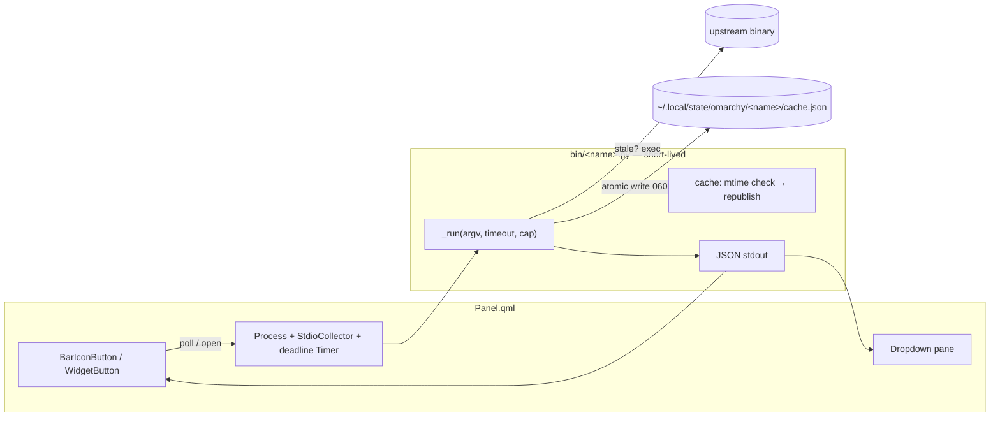

## Goal Capsule

**Objective:** three new Omarchy bar plugins — `io.github.duketopceo.bumblebee`, `io.github.duketopceo.numbat`, `io.github.duketopceo.pplx` — are listed-quality submissions: each detects its upstream binary, exposes its core signal on the bar, and hardens to the marketplace round-2 standard on day one.

**Means:** author once in the umbrella repo (`plugins/<id>/`), subtree-publish each to a standalone public repo, submit all three to `omacom/omarchy-plugin-marketplace` (KTD1).

**Authority:** this plan > upstream READMEs > sibling-plugin conventions. Upstream CLI flags are contract inputs, not guesses — verify against `bumblebee --help`, `numbat --help`, `pplx --help` at implementation time.

**Stop conditions:** a wrapped binary requires a behavior the plugin contract can't express (e.g. interactive TTY flows); a marketplace submission returns a finding that requires restructuring a helper boundary.

**Execution profile:** `ce-work` implementer with repo write access; helper changes are test-first where seams exist.

---

## Product Contract

### Summary

Perplexity ships three single-binary tools whose outputs are structured and small: **bumblebee** (read-only supply-chain exposure inventory, NDJSON), **numbat** (endpoint AI-agent activity visibility, NDJSON records), **pplx** (Perplexity Search API CLI, single JSON). Each maps cleanly onto the repo's established helper→JSON→panel pattern. The plugins are public-facing and BYO-binary: they detect, wrap, and render — they never vendor, install, or configure the upstream tool.

### Problem Frame

The tools are terminal-first and invisible to the desktop. An Omarchy user running coding agents has no ambient signal for agent activity (numbat), no standing answer to "does an advisory name something I have installed" (bumblebee), and no quick path to grounded search (pplx). The plugin layer turns each into a glanceable bar presence.

### Requirements

- **R1.** Three plugin dirs `plugins/io.github.duketopceo.{bumblebee,numbat,pplx}/` each containing `manifest.json`, `Panel.qml`, `bin/<helper>.py`, `README.md`, `LICENSE`, `preview.png`.
- **R2.** Upstream binaries resolve via `shutil.which(name, path=SAFE_PATH)`; absent → the helper emits a capability flag and the panel degrades (hidden bar item or install-hint pane). No dead calls, no PATH-resolved exec.
- **R3.** Every helper and Process follows the round-2 hardening standard: absolute `/usr/bin/python3`, `clearEnvironment` + fixed `procEnv`, stdout byte cap before `JSON.parse`, paired deadline Timer → `signal(9)`, helper-side `SIGALRM`/`_kill_tree` backstop, `os.setsid()` for group-reap.
- **R4.** All dynamic `Text` sinks use `Text.PlainText`; external/derived strings are control-char-normalized and length-clipped before render.
- **R5.** bumblebee plugin ships a curated starter exposure catalog (`catalog/exposures.json`, schema `0.2.0`) and merges a user-local catalog dir so users can add advisories without touching the plugin.
- **R6.** pplx resolves its key as `PERPLEXITY_API_KEY` env first, then `omaseal resolve` on a documented `omaseal://` ref; the key is injected via child env only — never argv, never logged, never rendered.
- **R7.** numbat plugin is a read-only consumer: it never runs `hook install`, never writes `~/.numbat/`, never enables enforce mode. If hooks aren't installed it shows a setup hint.
- **R8.** Each plugin publishes to its own public repo (`duketopceo/omarchy-{bumblebee,numbat,pplx}`) via `git subtree` push; `scripts/publish.sh` is reworked to key its repo map by full plugin id (it currently hardcodes `lukedaduke.$1`).
- **R9.** One `tests/test_<plugin>.py` per helper with injected fakes; umbrella CI (`validate-manifests.py` + pytest) stays green.
- **R10.** Each standalone repo carries install + removal sections, an External dependencies block naming the upstream tool + install path, LICENSE (MIT, sibling parity), and `preview.png`.
- **R11.** Launch copy drafted per plugin via `ce-promote` at publish time (X posts queued for the user to send).

### Scope Boundaries

- **Not shipping:** systemd units, auto-installers for upstream binaries, hook installation for numbat, a bundled threat-intel feed, pplx `content snippets` mode.
- **Deferred to follow-up:** bumblebee `project`/`deep` profiles; numbat timeline/case-bundle UI; pplx search filters (recency/domain pickers); AUR packages for the plugins themselves.
- **Outside identity:** these are wrappers — no forked or vendored upstream code (AGENTS.md).

### Dependencies

- Upstream releases `linux/arm64` + `linux/amd64`: `numbat_X.Y.Z_linux_arm64.tar.gz`, `bumblebee_X.Y.Z_linux_arm64.tar.gz`, `pplx-aarch64-linux-gnu.bin` — all confirmed published.
- AUR hazard: `numbat`/`numbat-git` in AUR is the **unrelated numbat.dev units language** — README must direct users to the GitHub release tarball, never `yay -S numbat`.
- Optional: OmaSeal for pplx key resolution (documented optional dep).

---

## Planning Contract

### Key Technical Decisions

- **KTD1 — Umbrella-managed, `io.github.duketopceo.*` ids.** New plugins live in `plugins/` like the six siblings, gaining shared CI/tests/install.sh for free. This inverts the `machine/plugins.json` precedent where `io.github.duketopceo.*` meant standalone-only (dayflow); the namespace is just an id, and umbrella membership is the property that matters. Governs R1, R8.
- **KTD2 — Lazy stale-cache refresh, no shipped timers.** Helpers are short-lived and panel-polled: each helper reads its cached result; when the cache is older than the plugin's interval it runs the upstream command, atomically republishes the cache, and returns fresh data. A scan that runs at panel-cadence gets gated by cache age, so a 6h cadence costs one exec per 6h. Governs R2, R3.
- **KTD3 — Bumblebee catalog is shipped + user-merged, never fetched.** Upstream supplies no threat intel; the plugin ships `catalog/exposures.json` (starter entries for well-known supply-chain incidents) and merges `~/.config/omarchy/plugins-data/bumblebee/catalog.d/*.json` so users self-serve new advisories. No network fetch inside the plugin — a fetched catalog would re-introduce a mutable integrity surface the marketplace reviewer would flag. Catalog updates ride plugin updates. Governs R5.
- **KTD4 — Numbat is observe-only.** The plugin reads `~/.numbat/records.ndjson` (bounded tail) and `numbat agents --all`/`scan` output. Hook installation is documented in README but performed by the user. Governs R7.
- **KTD5 — pplx key order: env → omaseal → absent.** `PERPLEXITY_API_KEY` wins (matches upstream precedence); else `omaseal resolve omaseal://perplexity/api-key` when `omaseal` is installed; else helper emits `{ok:false, needs_key:true}` and the panel shows a setup hint. Governs R6.
- **KTD6 — Capability-degrading panels.** Each helper's first field is `installed`/`ok`; the Panel renders empty/hidden or a bordered setup pane accordingly — the nexus/power degradation pattern, extended so a missing binary never renders a broken widget. Governs R2.

### High-Level Technical Design

All three plugins share this shape; only argv, cache path, and the emit schema differ.

### Assumptions

- `setting()`/manifest `schema` machinery works identically for `io.github.duketopceo.*` ids (it is id-agnostic).
- `omarchy plugin add <repo>` requires `manifest.json` at standalone repo root — subtree push provides exactly the plugin dir.
- bumblebee `baseline` profile rejects bare `$HOME` as root; the helper passes explicit `--root` values or accepts baseline's built-in source set.
- numbat `agents --all` JSON and `records.ndjson` schema (`record_type`, `schema_version`) may drift — parse defensively, never hardcode `schema_version`.

---

## Implementation Units

### U1. Umbrella plumbing for `io.github.duketopceo.*`

**Goal:** publish flow and catalogs accept the new namespace.
**Requirements:** R8
**Dependencies:** none
**Files:** `scripts/publish.sh`, `catalog.json`, `machine/plugins.json`, `machine/bar-layout.json`
**Approach:** key `publish.sh`'s repo map by full plugin id (`io.github.duketopceo.<name>` → `omarchy-<name>`), keeping `lukedaduke.*` entries working. `machine/plugins.json`: add the three ids to `first_party_from_this_repo` (the umbrella is their authoring home regardless of namespace).
**Test scenarios:** `publish.sh --dry-run` (or read the map directly) resolves `io.github.duketopceo.pplx` → `omarchy-pplx`; `lukedaduke.fan` still resolves.
**Verification:** script resolves all nine ids; no hardcoded `lukedaduke.$1` remains on the resolution path.

### U2. bumblebee engine

**Goal:** `bin/scan_bumblebee.py` produces `{installed, scanned_at, exposure_count, exposures:[{name,ecosystem,package,version,severity}], catalog_entries, error?}` from a stale-cache-or-scan cycle.
**Requirements:** R2, R3, R5
**Dependencies:** U1
**Files:** `plugins/io.github.duketopceo.bumblebee/bin/scan_bumblebee.py`, `plugins/io.github.duketopceo.bumblebee/catalog/exposures.json`, `tests/test_bumblebee.py`
**Approach:** locate `bumblebee` via `_tool()`; cache at `~/.local/state/omarchy/bumblebee/last-scan.json` (descriptor-relative dir open, owner+regular-file verified, 64KiB read cap, O_EXCL temp+rename 0600 publish); when cache older than `SCAN_INTERVAL_S` (6h default) run `bumblebee scan --profile baseline --exposure-catalog <pluginRoot>/catalog --exposure-catalog <user-catalog-dir> --findings-only --output stdout` under `_run()` cap/deadline; parse NDJSON `record_type=="finding"` lines only; `scan_summary.status` other than `complete` surfaces `partial:true`. Ships `catalog/exposures.json` with a handful of well-known incidents (e.g. chalk/debug Sept-2025 npm compromise pattern entries) as a maintained starting point; document the merge dir `~/.config/omarchy/plugins-data/bumblebee/catalog.d/`.
**Execution note:** implement helper test-first — the NDJSON parsing and cache-staleness gate are pure functions with injected fetch/clock seams.
**Patterns to follow:** `plugins/lukedaduke.nexus/bin/probe_nexus.py` (`_tool`, `_run`, `_kill_tree`, `SIGALRM`, `setsid`, `MAX_OUT_BYTES`), `plugins/lukedaduke.standby/bin/standby-data` (descriptor-relative cache I/O).
**Test scenarios:** missing binary → `{installed:false}`; cache fresh → no exec, cached payload returned; cache stale → scan runs, NDJSON findings parsed, cache republished atomically; malformed NDJSON line skipped; `scan_summary.status=="partial"` → `partial` flag set; oversized output → truncated at cap, error recorded; user catalog dir missing → shipped catalog only.
**Verification:** helper emits valid JSON in all states; planted `catalog.d` entry merges; no file outside `~/.local/state/omarchy/bumblebee/` written.

### U3. numbat engine

**Goal:** `bin/probe_numbat.py` produces `{installed, hooks_seen, active_agents:[{name,last_event}], findings_24h, findings:[{rule,observed_at}], records_path}` — the radar's data packet.
**Requirements:** R2, R3, R7
**Dependencies:** U1
**Files:** `plugins/io.github.duketopceo.numbat/bin/probe_numbat.py`, `tests/test_numbat.py`
**Approach:** `_tool("numbat")` absent → `{installed:false}`. Otherwise: bounded tail-read of `~/.numbat/records.ndjson` (descriptor-relative, read last ≤256KiB, tolerate partial final line), count `record_type=="finding"` within 24h, derive `active_agents` from recent `record_type=="event"` `source_agent` values (capped, clipped strings); optionally `numbat agents --all` under `_run` for the discovery list when records are absent. `hooks_seen` is inferred from records existence — no probing agent config files.
**Test scenarios:** missing binary → `installed:false`; missing `~/.numbat/` → `installed:true, hooks_seen:false` (setup-hint state); records with mixed event/finding lines → correct `findings_24h` and agent list; truncated/binary garbage tail → skipped lines, no crash; >256KiB file → tail-read still bounded.
**Verification:** helper never writes anywhere; output schema stable across numbat `schema_version` drift (parse by `record_type`, not version string).

### U4. pplx engine

**Goal:** `bin/pplx_search.py "<query>"` emits `{ok, needs_key?, hits:[{title,url,domain,snippet,date}], error?}` and `bin/pplx_status.py` emits `{installed, authed}` for the bar icon state.
**Requirements:** R2, R3, R6
**Dependencies:** U1
**Files:** `plugins/io.github.duketopceo.pplx/bin/pplx_search.py`, `plugins/io.github.duketopceo.pplx/bin/pplx_status.py`, `tests/test_pplx.py`
**Approach:** key resolution per KTD5; subprocess env gets `PERPLEXITY_API_KEY` injected only when resolved; run `pplx search web <query> --limit 8` under `_run`; parse `hits[]` (ranked list — no synthesized answer exists); map stderr `{error:{code,message}}` to `error` field, `AUTHENTICATION` → `needs_key`. `pplx_status` checks binary presence + whether a key resolves, without calling the API.
**Test scenarios:** no key → `{ok:false, needs_key:true}` without exec; env key present → exec with injected env, argv contains no key material; hits JSON → compacted list, snippets clipped + control-stripped; stderr `AUTHENTICATION` JSON → `needs_key`; timeout → `error:"timeout"`; query with shell metachars → passed as single argv element unchanged.
**Verification:** `strings`/`ps` inspection shows key never on argv; helper exits within deadline on a hung subprocess (fake via test double).

### U5. Panels — three `Panel.qml`

**Goal:** bar widget + dropdown for each plugin, sharing the house pattern.
**Requirements:** R2, R4
**Dependencies:** U2, U3, U4
**Files:** `plugins/io.github.duketopceo.{bumblebee,numbat,pplx}/Panel.qml`
**Approach:** copy the `plugins/lukedaduke.nexus/Panel.qml` skeleton (`pluginRoot`/`py`/`procEnv`, `BarIconButton`, `KeyboardPanel`, `StdioCollector` + cap + deadline Timer + `onExited` stop, `switchPanel` key handling). Per-plugin shape:
- **bumblebee:** shield glyph, `active`/`urgent` styling when `exposure_count>0`; dropdown lists findings (name, ecosystem, package@version, severity) + "last scanned" line; 60s poll of the cache-backed helper.
- **numbat:** radar glyph + active-agent count; dropdown = findings (24h) then per-agent last-activity lines; setup-hint pane when `hooks_seen:false`; 15s poll.
- **pplx:** `?`/search glyph; dropdown has a `TextInput` quick-ask field → Enter runs `pplx_search.py`, results list opens links via pinned `/usr/bin/xdg-open`; setup pane when `needs_key`/`installed:false`.
**Patterns to follow:** `Text.PlainText` on every dynamic sink; `clipStr()` before external strings reach Text; settings via `setting()` for intervals; `ipcTarget`/`moduleName` = full plugin id (never `omarchy.*`).
**Test scenarios:** QML parse-clean (qmllint or `qs` load if available); absent-binary renders degrade state, not errors; findings list renders with PlainText; keyboard nav works (j/k/Enter/Esc); oversized helper output drops without poisoning state.
**Verification:** each panel loads under Quickshell on the live bar with no console errors; widget hides or hints correctly with the binary removed.

### U6. Manifests, settings, catalog entries

**Goal:** each plugin's `manifest.json` validates and exposes the right settings; `catalog.json` gains three entries.
**Requirements:** R1, R9
**Dependencies:** U5
**Files:** `plugins/io.github.duketopceo.{bumblebee,numbat,pplx}/manifest.json`, `catalog.json`
**Approach:** sibling-shaped manifest (`schemaVersion:1`, id==dir name, `kinds:["bar-widget"]`, `activation:"on-demand"`, `entryPoints.barWidget:"Panel.qml"`, `barWidget{...}` with `defaultSection:"right"`). Settings `schema`/`defaults`: bumblebee `scanIntervalHours`; numbat `pollSeconds`,`findingsWindowHours`; pplx `resultLimit`. `catalog.json` entries with repo URLs `omarchy-<name>`.
**Test scenarios:** `scripts/validate-manifests.py` passes; manifest version == catalog version.
**Verification:** `python scripts/validate-manifests.py` output `ok: 10 manifests`.

### U7. Tests

**Goal:** one pytest module per helper, wired into existing `tests/` + CI.
**Requirements:** R9
**Dependencies:** U2, U3, U4
**Files:** `tests/test_bumblebee.py`, `tests/test_numbat.py`, `tests/test_pplx.py`
**Approach:** `importlib` load-by-path (extensionless-safe loader pattern from `tests/test_fan_stats.py`), injected fakes for `_run`/filesystem/clock seams.
**Test scenarios:** the per-unit scenarios in U2–U4 are the suite.
**Verification:** `python -m pytest tests/ -q` green locally and on `ubuntu-latest` CI.

### U8. Public surfaces — README, LICENSE, preview, docs

**Goal:** each plugin is submission-ready: README (install + removal + external deps + privacy note), MIT LICENSE, `preview.png`.
**Requirements:** R10
**Dependencies:** U5
**Files:** `plugins/io.github.duketopceo.{bumblebee,numbat,pplx}/{README.md,LICENSE,preview.png}`, `plugins/io.github.duketopceo.bumblebee/catalog/README.md`
**Approach:** README shape copies `plugins/lukedaduke.power/README.md` (install `omarchy plugin add`, removal `disable`/`remove`, deps block). bumblebee README documents the shipped catalog + `catalog.d` merge dir; numbat README documents the user-run `numbat hook install` step and the AUR name-collision warning; pplx README documents key setup (`PERPLEXITY_API_KEY` or `omaseal set perplexity api-key`). Preview cards: 1280×720 Miasma-palette style matching the six existing `preview.png`s.
**Verification:** `omarchy plugin validate` clean on a scratch clone of each subtree; secrets/host-path grep returns nothing (`token|secret|api[_-]?key|password|/home/`).

### U9. Publish, submit, announce

**Goal:** three standalone repos live, three marketplace issues filed, X drafts ready.
**Requirements:** R8, R10, R11
**Dependencies:** U6, U7, U8
**Files:** none in-repo (repos + issues created)
**Approach:** create `duketopceo/omarchy-{bumblebee,numbat,pplx}`; `publish.sh` subtree-push each; verify exec bits + root `manifest.json` in fresh clones; file three marketplace issues with the exact six-heading body (category: bumblebee/numbat → `System` + tags `security, bar, system` / `system, ai, bar`; pplx → `Productivity` or `Developer Tools` + `launcher, bar, ai`); `ce-promote` for X copy per plugin (user posts).
**Test scenarios:** `omarchy plugin add <repo>` + `enable <id>` round-trips on this machine from the standalone clone.
**Verification:** issues return `validated`; security-baseline verdicts posted; submission issue URLs recorded.

---

## Verification Contract

- `python scripts/validate-manifests.py` → `ok: 10 manifests`
- `python -m pytest tests/ -q` — green (new modules included)
- `go`-free repo: helpers verified via pytest; QML verified by live bar load + `omarchy plugin validate` on standalone clones
- Pre-publish secrets scan: `grep -rniE '(token|secret|api[_-]?key|password|/home/)' plugins/io.github.duketopceo.*` → clean
- Marketplace: each issue reaches `validated` then `listed`/`approved-and-verified` (reviewer latency is out of scope; reaching `validated` is the plan's bar)

## Definition of Done

- All nine units landed; each helper's test module passes; manifests validate.
- Panels load live with binaries present and absent; no unowned writes, no PATH-resolved exec, no MarkdownText anywhere.
- Three standalone repos pushed with manifest-at-root; three marketplace issues filed and `validated`.
- X drafts delivered to the user (user posts).
- Cleanup: no scratch helpers, dead branches, or abandoned preview iterations left in the diff.

## Sources / Research

- Upstream: `github.com/perplexityai/{bumblebee,numbat,perplexity-cli}` READMEs + release assets (arm64 confirmed); numbat `docs/agent-coverage.md`, `docs/schema/v0.3.0/`; bumblebee `docs/inventory-sources.md`; pplx install.sh behavior + `~/.config/perplexity/credentials.json` store.
- House patterns: `plugins/lukedaduke.nexus/` (helper contract), `lukedaduke.power/` (persistent-state env variant), `lukedaduke.standby/` (descriptor-relative cache), `lukedaduke.fan/` (ownership-marker + control-file hardening).
- Review learnings: `docs/plans/2026-09-12-1541-feat-marketplace-security-round2-plan.md` (finding classes A–L distilled); dayflow #4992 + OmaSeal #5620 marketplace findings.
- Decision-changers found in research: bumblebee ships **no** bundled exposure catalog (KTD3); `numbat` AUR name is the units language (R10 README warning); pplx `auth login` is TTY-only → env-var path (KTD5); all upstream versions are v0.x — pin guidance in READMEs.
