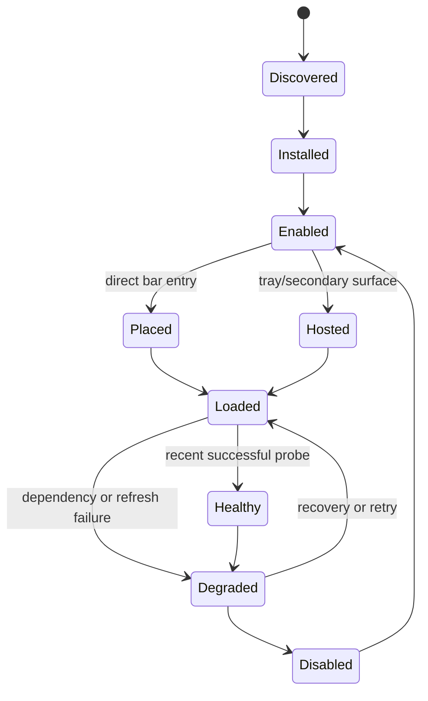
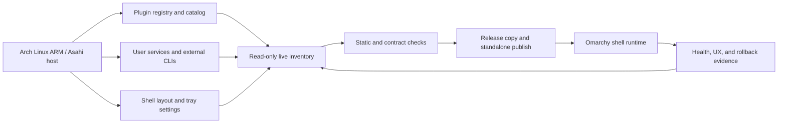
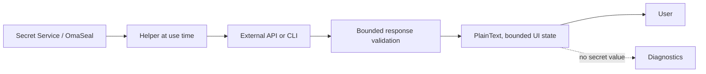
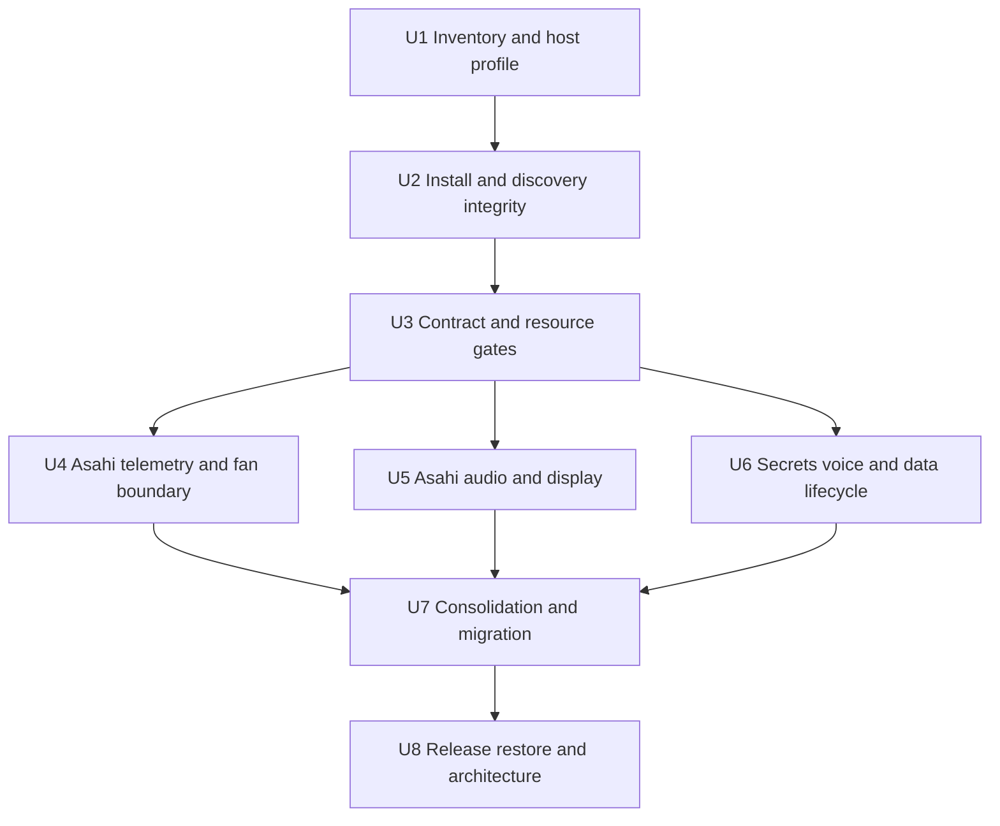

# feat: Harden, package, and consolidate the active Omarchy plugin estate

## Summary

Make the enabled Omarchy plugin set observable, installable, safe on the current
Arch Linux ARM/Asahi M1 Max host, and explicit about which surfaces are canonical
versus replacements. The plan keeps third-party ownership boundaries intact while
repairing the local source/install state, adding a shared review contract,
hardening Apple Silicon integrations, and defining a reversible consolidation
and release path.

The first deliverable is a trustworthy inventory and state model. Behavior and
packaging changes follow that model so a green helper test cannot hide an old
backup, a disabled-but-hosted widget, or a service that is running but not
actually managing the hardware.

## Problem Frame

The desktop has grown by accretion. The registry discovers 70 plugins, 49 are
enabled, and 29 bar entries are present. The registry's `active` field means
“the full-bar option is selected”; it does not mean that a component is
running. Twenty enabled plugins are intentionally implicit services, overlays,
or panels, and two widgets are hosted inside the custom tray rather than listed
as direct bar entries. A single “active plugins” list therefore hides real
runtime state.

The source tree is not the same as the loaded source. The installer creates
`*.bak.<timestamp>` directories inside the plugin scan root. The catalog chooses
the older backup for `lukedaduke.power` and `lukedaduke.connections`, so live
behavior can silently lag the umbrella checkout. Several external checkouts
also contain local modifications, and the current working tree contains
in-progress GPU work. A broad audit cannot safely overwrite those trees.

The host inventory is stale: the committed machine map describes a Dell
Precision x86-era machine, while the live host is an Apple MacBook Pro M1 Max
running Arch Linux ARM with Asahi, PipeWire/WirePlumber, BlueZ, UPower, and
custom Apple audio/display services. The restore map would install the wrong
package family and omit services that the current desktop depends on.

The live estate also contains overlapping and high-trust surfaces. Stock
clipboard and Clipboard Plus share one history; OmaSeal and a dev secrets panel
share one keyring; the stock audio, clock, lock, tray, power, active-window, and
agent surfaces are disabled in favor of replacements; Dayflow, Dim, and
Voxtype all touch audio or private data; and custom tray-hosted widgets are not
represented in the registry's enabled set. The result is a lot of capability,
but no single answer to “what owns this state?” or “what happens when its
dependency fails?”

## Baseline Snapshot

The snapshot below is the planning baseline for 2026-09-23. Counts come from
the live registry, catalog, shell layout, and user-service inventory. It is
evidence, not a promise that the current source is healthy.

| Signal | Observed baseline | Planning consequence |
|---|---:|---|
| Discovered plugins | 70 | Inventory every discovered manifest, including disabled and hosted entries. |
| Enabled plugins | 49 | Preserve the complete enabled surface; do not optimize only the bar. |
| First-party enabled plugins | 24 | Treat host code as read-only; use clones, host issues, or user configuration. |
| Third-party enabled plugins | 25 | Track ownership and release provenance separately. |
| Direct bar entries | 29 | Preserve settings and ordering during migration. |
| Enabled but not direct bar entries | 20 | Include implicit services, panels, and overlays in health checks. |
| Tray-hosted widget exceptions | 2 | Model hosted widgets as active surfaces rather than disabled plugins. |
| Live umbrella tests | 263 passing | Keep the existing suite green while adding contract and host checks. |
| Live umbrella manifests | 10 validated | Extend validation to release copies and the enabled external inventory. |
| Host | aarch64 Asahi, Apple MacBookPro18,2 M1 Max, 62 GiB unified memory | Make capability probes and honest degradation the default. |

### First-party enabled inventory

| Plugin | Surface | Host role | Assessment and boundary |
|---|---|---|---|
| `omarchy.bar` | full-bar option | Bar host and layout | Keep as the host-owned bar. The registry’s `active` flag is authoritative only for this plugin. |
| `omarchy.background` | implicit service | Wallpaper/background control | Keep host-owned; no local fork unless a demonstrated regression requires one. |
| `omarchy.battery` | implicit service | UPower battery notifications | Keep; verify the Asahi display-device and low-battery icon paths. |
| `omarchy.clipboard` | implicit overlay | Clipboard watcher/history | Keep as the single clipboard history owner; companion overlays must not start a second watcher. |
| `omarchy.dev-gallery` | implicit panel | Developer gallery | Keep optional; it is not a distribution surface for the custom catalog. |
| `omarchy.disk-speedtest` | implicit panel | Disk benchmark | Keep optional; add an Apple NVMe smoke check to the host audit. |
| `omarchy.emojis` | implicit overlay | Emoji picker | Keep host-owned. |
| `omarchy.idle` | implicit service | Idle, blank, and lock timing | Critical dependency; verify caffeine and lock-explorer interactions. |
| `omarchy.image-picker` | implicit overlay | Image selection | Keep host-owned; callers must be checked when overlays change. |
| `omarchy.indicators` | bar widget | Status indicators | Keep; treat duplicate IPC warnings as a host-reload symptom, not a reason to edit host code here. |
| `omarchy.media` | service + bar widget | PipeWire media state | Keep; verify Asahi audio and PipeWire channel-map behavior. |
| `omarchy.menu` | menu + bar widget | Omarchy launcher/menu | Keep as the host menu owner; third-party menu extensions must be additive. |
| `omarchy.microphone` | bar widget | Microphone state | Keep; verify the Asahi microphone mapping service. |
| `omarchy.nightlight` | implicit service | Hyprland night light | Keep host-owned. |
| `omarchy.notifications` | implicit service | Notification and DND routing | Keep; external notification producers must remain bounded. |
| `omarchy.osd` | implicit panel | On-screen display | Keep host-owned. |
| `omarchy.polkit` | implicit service | Authentication agent | Keep; privileged plugin actions must use a visible policy boundary. |
| `omarchy.reminders` | implicit overlay | Reminder flow | Keep host-owned. |
| `omarchy.speedtest` | implicit panel | Network speed test | Keep optional; expose dependency and network failures. |
| `omarchy.system-update` | bar widget | Package update status | Keep; verify Arch Linux ARM/Asahi package semantics. |
| `omarchy.tailscale` | bar widget | Tailscale status/actions | Keep; remove the unused custom Tailscale clone from restore guidance. |
| `omarchy.weather` | bar widget | Weather data | Keep; network/privacy state must be visible when stale. |
| `omarchy.wifiqr` | implicit panel | Wi-Fi QR sharing | Keep optional; no new service or credential store. |
| `omarchy.workspaces` | bar widget | Hyprland workspaces | Keep host-owned and compatible with tray hosting. |

### Third-party enabled inventory

| Plugin | Surface | Current signal | Disposition |
|---|---|---|---|
| `akitaonrails.ai-usagebar` | bar widget | ARM64 binary works; checkout is locally modified, contains a large build tree, and has no release preview in the local copy. | Keep as the canonical AI-usage surface; package from a clean release tree and add a health/setup contract. |
| `ssupt.audio-control` | bar widget + panel | Replaces stock audio; large QML surface, many process/timer paths, inconsistent PlainText coverage, and no manifest license field. | Keep separate from stock audio; harden output encoding, capability gating, package metadata, and EasyEffects failure UX. |
| `nixfred.blip` | bar widget | Active Mac-gateway SSH watcher; Linux side is a thin client. | Keep separate; make gateway reachability, stale state, attachment retention, and privacy visible. |
| `io.github.duketopceo.bumblebee` | service + bar widget | ARM64 binary and live helper work; cache-error and redirect-integrity fixes are present in the current source and still need release evidence. | Keep and harden; publish from a pinned, clean standalone tree. |
| `tmn73.calendar` | bar widget | Replaces the clock; a stale event file exists while the Google sync account has no usable auth. | Keep, but show sync health and encode event text defensively. |
| `io.github.idr4n.clipboard-plus` | overlay | Companion to the stock clipboard history; no second watcher is desired. | Keep as a companion, with one explicit keybinding owner and shared-history tests. |
| `lukedaduke.connections` | bar widget | Catalog currently selects an old backup copy; the current source composes stock Bluetooth/network panels. | Repair source selection and duplicate-IPC behavior; retain only if the composite remains valuable. |
| `io.github.duketopceo.dayflow` | bar widget + engine | Capture service is active; frames and backups consume several GB and the model/recap paths can egress data. | Keep, but gate on privacy, retention, storage, and explicit egress controls. |
| `io.github.duketopceo.dim` | service + bar widget + overlay | `dimd` is active; the UI polls quickly, renders assistant text, overlaps Voxtype’s audio domain, and the local copy has no package documentation/license/preview. | Keep only with a single-voice-stack policy, bounded polling, LLM-output encoding, and a release-ready package. |
| `robzolkos.github` | bar widget | Uses the GitHub CLI/API and has a mature feature surface; remote data and rate/error states need consistent handling. | Keep independent; add contract checks and actionable degraded states. |
| `io.github.sirjul1337.lock-explorer` | service + overlay | Replaces the stock lock service; live boot-preview assets are missing and lock/PAM changes are high impact. | Keep separate and security-reviewed; make asset, PAM, and lock-health failures explicit. |
| `lukekimball.active-window` | bar widget | A minimal active-window clone with a current binding-loop warning and no package documentation. | Default to retirement in favor of the stock widget; preserve the Rowboat fallback only if it proves necessary. |
| `io.github.duketopceo.numbat` | service + bar widget | ARM64 binary is installed; live records are streaming; the current source has aligned watchdog bounds but still needs upstream/schema release evidence. | Keep and harden; preserve observe-only boundaries and pinned upstream provenance. |
| `io.github.duketopceo.omaseal` | bar widget | Keyring is the de facto secret backend; the local checkout is not git-backed, has no release preview, and overlaps the dev secrets panel. | Make OmaSeal the canonical secret surface, package it cleanly, and retire the dev preview. |
| `io.github.twiking.omasettings` | bar widget + service | Broad settings editor with config-write/undo behavior; plugin-management responsibilities overlap Omaplug. | Keep as the settings authority; assign plugin lifecycle/update ownership elsewhere. |
| `mohamedmansour.finance` | bar widget | Yahoo-backed watchlist; checkout is locally modified and remote values need defensive rendering. | Keep optional; require explicit network/data-state UX and clean release provenance. |
| `io.github.ncr.omaphones` | service + bar widget | Bluetooth battery/ANC surface is broad and well-tested, but live anchor-lifecycle warnings occur. | Keep; fix lifecycle/anchor handling upstream and test Asahi BlueZ/hidpp paths. |
| `io.github.duketopceo.pplx` | bar widget | ARM64 helper is installed, authenticated, and OmaSeal-aware; cancel/error behavior still needs polish. | Keep and harden; retain the key-at-use-time contract. |
| `omaplug` | bar widget | Plugin manager has a large local diff and duplicate IPC warnings; its role overlaps OmaSettings. | Keep only for lifecycle/update management, with a single ownership boundary and clean source. |
| `lukedaduke.power` | bar widget | Catalog currently selects an old backup copy; the umbrella has newer battery/history hardening and tests. | Repair source selection, history concurrency, and IPC namespace before release. |
| `lukedaduke.fan` | bar widget | Apple M1 Max telemetry works, but GPU utilization is unavailable, fan controls are read-only, the daemon is not installed, and the starter retrieves a stored sudo password. | Highest-priority owned remediation; split telemetry from privileged fan control. |
| `localdev.secrets` | panel | Dev preview over the same Secret Service collection as OmaSeal; no package metadata. | Retire from the active surface after the OmaSeal handoff. |
| `lukedaduke.standby` | overlay | Current marker/weather handling is substantially corrected; useful OLED nightstand surface. | Keep optional; add explicit stale-weather and lock/idle safety checks. |
| `io.github.tyrichards.tray` | bar widget | Replaces the stock tray and hosts widgets; live teardown emits null-delegate errors. | Fix upstream lifecycle behavior or provide a stock-tray fallback decision. |
| `crmne.hyprmoncfg` | bar widget + service | ARM64 daemon is installed, but management is currently off and Apple lid/input permissions produce warnings. | Keep with an explicit managed/unmanaged state and an Asahi-compatible fallback. |

### Indirect and disabled surfaces

`jankeesvw.herdr` and `lukedaduke.nexus` are direct tray-hosted widgets even though
the registry reports them as disabled. `lukedaduke.ticker`,
`lukedaduke.agents`, and `lukedaduke.tailscale` are disabled local/custom
surfaces with no current bar placement. The stock clock, audio, power, lock,
tray, active-window, and agents plugins are disabled because replacements are
present or the operator has not enabled them. The next inventory must label
each of these states explicitly rather than treating “disabled” as “unused.”
The disabled owned `lukedaduke.agents` clone also carries prior rich-text,
provider-contract, and process-lifecycle findings; it should not be re-enabled
as a fallback until the contract gate and its helper dependency are satisfied.

### Current cross-cutting findings

- The live install has duplicate manifest IDs in non-hidden backup directories;
  the catalog resolves `lukedaduke.power` and `lukedaduke.connections` to older
  backup trees.
- The live fan helper reports Apple M1 Max GPU name, shared die temperature,
  package power, and a client-process list, but no true utilization value. The
  current control capability check treats read-only fan targets as writable.
- The fan daemon unit is not installed as a user unit, while the panel advertises
  a daemon-trigger path. The current starter’s OmaSeal password lookup and
  `sudo -S` path must not survive a release review.
- Calendar data can remain on disk while sync authentication fails. Dayflow
  keeps frames and backups well beyond a small glanceable cache. Dim and
  Voxtype are both resident voice services, with different recording and
  transcription defaults.
- EasyEffects has a recent core-dump/restart failure and plugin errors on the
  ARM host. Audio plugins need a dependency-health state rather than an
  unconditional DSP claim.
- Several enabled QML surfaces bind device names, remote titles, LLM output, or
  configuration values without explicit `Text.PlainText`. This is a shared
  trust-boundary gap, not one plugin’s cosmetic issue.
- The custom tray, active-window clone, Omaphones panel, lock explorer, and
  Hyprland monitor service emit lifecycle or host-integration warnings. These
  are visible reliability signals even where the feature still works.
- The AI usage checkout is hundreds of megabytes because build output is inside
  the plugin source tree. Release packaging must separate source, binaries, and
  generated artifacts.

## Requirements

### Inventory and ownership

- R1. A sanitized, committed inventory records every discovered plugin, its
  source/owner, manifest version, enabled state, direct or hosted surface,
  dependency class, Apple Silicon support, and disposition.
- R2. The inventory distinguishes registry-enabled, bar-placed, tray-hosted,
  loaded, running, healthy, degraded, and disabled states; a tray-hosted widget
  is never reported as unused solely because it is absent from the direct bar
  layout.
- R3. One plugin ID resolves to one intended source tree, and installer backups
  cannot be rediscovered as competing manifests.
- R4. Release artifacts are self-contained and reproducible: manifests, entry
  points, license, documentation, version parity, pinned external tools, and
  clean copies are verified before publication.

### UX, reliability, and security

- R5. Every enabled surface presents honest setup, ready, offline, degraded, and
  last-success states with an actionable recovery path instead of an empty or
  misleading control.
- R6. Remote, device-derived, configuration-derived, and LLM-derived text is
  bounded, validated, and rendered as plain text; secrets never enter argv,
  environment, logs, QML state, process metadata, or user-facing diagnostics in
  the supported release path.
- R7. Long-lived helpers have fixed executable paths, minimal environments,
  bounded I/O, stderr collection, deadlines, and tree-safe termination; polling
  work has a documented budget and is gated when its surface is not needed.
- R8. Replacement and cloned surfaces have one owner for each IPC target,
  hotkey, service, and data source; hosted tray widgets are included in conflict
  detection.

### Apple Silicon and host integration

- R9. Hardware telemetry works on the current aarch64 Asahi M1 Max and degrades
  honestly on other architectures; fan, SoC, GPU, battery, and package-power
  labels distinguish direct values from proxies and unavailable values.
- R10. Audio, display, input, and Bluetooth surfaces handle Asahi services,
  PipeWire/WirePlumber, BlueZ/hidpp, lid/suspend, and hotplug events without
  crashing or silently claiming that a dependency is healthy.
- R11. Privileged fan actions use a visible, least-privilege authorization path;
  telemetry-only mode never requests elevation, and no plugin retrieves a
  stored sudo password to feed an elevation command.
- R12. The machine restore map describes the current Arch Linux ARM/Asahi host,
  its package families, Apple-specific services, enabled plugin state, and
  sanitized bar layout without secrets.

### Data and distribution

- R13. OmaSeal is the canonical secret surface; keyring-backed consumers resolve
  secrets at use time and handle a locked or unavailable keyring explicitly.
- R14. Screen, audio, clipboard, remote-message, calendar, finance, and weather
  data have an explicit purpose, egress policy, retention/storage budget, and
  pause/delete/export path; voice services are not simultaneously active by
  default.
- R15. Owned plugins publish through the umbrella/subtree model with pinned
  versions and architecture evidence; third-party plugins remain independently
  owned and are tracked through upstream updates or narrowly scoped local
  configuration rather than vendored into this repository.
- R16. Verification includes unit/static/contract tests, a native aarch64 host
  smoke path, fresh-copy installation, and a reversible rollback for shell and
  service changes.

## Acceptance Examples

- AE1. Given a widget hosted only inside the custom tray, the inventory marks it
  as enabled and hosted, and the plugin manager does not recommend removing it
  as unused.
- AE2. Given an Asahi host with no DRM utilization counter or writable fan
  target, the fan panel shows telemetry and an unavailable reason, and opening
  it does not request elevation.
- AE3. Given a failed Google Calendar refresh with an old event file, the
  calendar surface labels the data stale and offers the documented auth or
  network recovery action.
- AE4. Given a locked keyring or a missing external binary, a consumer shows a
  setup state without falling back to plaintext secrets or a blank panel.
- AE5. Given a plugin whose source directory is shadowed by a backup, release
  validation fails before publication and the live catalog is repaired only
  through the reversible migration path.
- AE6. Given two voice daemons configured for the same microphone, the host
  audit identifies the conflict and the migration leaves exactly one default
  owner.

## Key Technical Decisions

- KTD1. Make a read-only inventory and state model the first contract. The host
  registry already distinguishes configuration presence from bar selection, but
  its user-facing list is not a complete runtime inventory. Auditing the host
  behavior is safer than editing host-owned code from this repository.
- KTD2. Repair installation and live discovery before judging plugin behavior.
  `catalog.json` is repository metadata, not the host registry; the live
  registry is rebuilt from the intended source directories after backups leave
  the discovery root. A backup directory winning discovery makes every later
  test result ambiguous.
- KTD3. Keep development links, release copies, and standalone repositories as
  explicit modes. Backups move outside the discovery root; release validation
  runs on a non-symlink copy.
- KTD4. Add a static contract checker, not a shared QML runtime module. The
  repeated patterns justify one checker and documentation layer; a sibling QML
  import would create an import-path and release-coupling problem across
  independently owned plugins.
- KTD5. Split privileged fan control from the fan telemetry widget. The plugin
  owns read-only telemetry and a user-facing mode request; a separately owned,
  policy-gated system helper owns root writes and service installation.
- KTD6. Preserve third-party ownership boundaries. The catalog records remotes,
  versions, architecture, and follow-up status; it does not copy third-party
  source into the umbrella or claim marketplace ownership.
- KTD7. Consolidate by responsibility, not by making one giant plugin. OmaSeal
  owns secrets, OmaSettings owns configuration editing, Omaplug owns plugin
  lifecycle, and the stock or replacement surface owns its domain. Overlap is
  removed through explicit ownership and migration.
- KTD8. Use capability probes and honest nulls for Apple Silicon. A missing
  DRM utilization counter, read-only fan target, or unavailable optional tool
  is a valid state; a fabricated value is not.
- KTD9. Treat privacy and performance as contracts. Persistent agents need
  bounded retention, explicit egress, a storage budget, and a single default
  voice path; bar widgets should not run an uncached expensive collector on a
  permanent cadence.
- KTD10. Release provenance is part of correctness. Pin external tool versions
  and checksums, exclude generated output, verify manifest/catalog/standalone
  parity, and test each claimed supported architecture.
- KTD11. Use the Secret Service API or an inherited file descriptor/stdin
  channel for key handoff; do not rely on ambient environment variables or CLI
  arguments. A binary that cannot accept a bounded, non-persistent handoff is
  an explicit compatibility limitation, not a reason to weaken the release
  contract.

## High-Level Technical Design

The state model is intentionally richer than the registry's boolean:

`Enabled` answers “is this ID configured?”; `Placed` and `Hosted` answer
“where is it visible?”; `Loaded` and `Healthy` answer “is it actually working?”
The inventory and doctor output use these terms consistently.

Secret and external-data flow is one-way and explicit:

## Implementation Units

### U1. Canonical live inventory and host profile

- **Goal:** Make the current 70-plugin estate, its indirect surfaces, and its
  host services reproducible and reviewable before behavior changes begin.
- **Requirements:** R1, R2, R12, R16
- **Dependencies:** none
- **Files:**
  - `scripts/audit-live-plugins.py` (new)
  - `docs/reviews/active-plugin-estate.md` (new)
  - `tests/test_plugin_inventory.py` (new)
  - `machine/INDEX.md`
  - `machine/plugins.json`
  - `machine/bar-layout.json`
  - `machine/packages-explicit.txt`
  - `machine/packages-foreign.txt`
  - `machine/RESTORE.md`
  - `AGENTS.md`
- **Approach:** Define a sanitized inventory schema that separates source
  ownership, registry state, surface, loaded/healthy state, dependency class,
  architecture support, and disposition. The audit reads the registry/catalog,
  shell layout, tray-hosted settings, git status, available commands, and
  relevant user services. All host inputs must be injectable through fixture
  roots and bounded probes; the default mode is read-only and must not read
  secret values or write live configuration. Record the current count
  reconciliation and the indirect tray entries in the review artifact. Refresh
  the machine map to the live
  Arch Linux ARM/Asahi host and split generic packages from Apple-specific
  services.
- **Test scenarios:**
  - A direct bar entry, a top-level service, and a tray-hosted widget produce
    distinct surface/state fields.
  - A first-party plugin absent from explicit configuration but enabled by
    default is reported as implicit, not disabled.
  - A duplicate manifest ID from a backup directory is reported as a conflict
    with no absolute path or secret value in the output.
  - A missing manifest, missing entry point, dirty checkout, or missing native
    binary produces an actionable warning rather than a crash.
  - Redaction fixtures prove API keys, passwords, tokens, and environment
    values never enter the inventory artifact.
  - A fixture-root run produces the same state model without reading or writing
    the live shell, registry, or service manager.
- **Verification:** The generated audit reproduces 70 discovered, 49 enabled,
  29 direct bar entries, 20 enabled non-bar entries, and two indirect tray
  widgets on the baseline host. The committed review and machine files contain
  no secret values or user/source-checkout absolute paths; restore instructions
  use runtime variables or placeholders where a filesystem location is needed.

### U2. Installation, discovery, and source-selection integrity

- **Goal:** Ensure the intended checkout is the only candidate for each plugin
  ID and that release copies are not accidentally treated as live plugins.
- **Requirements:** R3, R4, R15, R16
- **Dependencies:** U1
- **Files:**
  - `scripts/install.sh`
  - `scripts/validate-manifests.py`
  - `scripts/publish.sh`
  - `tests/test_install_layout.py` (new)
  - `tests/test_manifests.py`
  - `catalog.json`
  - `docs/UPSTREAM.md`
- **Approach:** Move timestamped installer backups to a dedicated state location
  outside the plugin discovery root, preserve rollback metadata, and make
  repeated installs idempotent. Treat `catalog.json` as umbrella metadata;
  repair the live source map through the installer and let the host rescan
  rebuild its registry rather than hand-editing host-owned state. Add a preflight
  that detects duplicate IDs, stale backup manifests, symlinked release copies,
  generated artifacts, and user/source-checkout absolute paths before a shell
  rescan. Keep `--link` for development and make `--copy` the validated release
  path. Extend manifest validation to enforce package metadata and entry-point
  integrity without treating an intentionally linked development directory as a
  release artifact.
- **Test scenarios:**
  - Replacing a real plugin directory creates a backup outside the discovery
    root and leaves one discoverable manifest.
  - Re-running the installer against the intended symlink is a no-op.
  - Two non-hidden directories with the same manifest ID fail preflight with
    both logical IDs named and no destructive action taken.
  - A release copy with a symlink, generated binary tree, missing license/docs,
    or mismatched version fails validation.
  - A failed shell rescan does not corrupt the persisted layout or discard the
    rollback copy.
  - The host registry is rebuilt through the supported rescan path; no test or
    migration hand-edits host-owned registry state.
- **Verification:** The live catalog resolves `lukedaduke.power` and
  `lukedaduke.connections` to the intended current source after migration;
  no backup directory remains discoverable; copied release directories pass
  validation without a symlink exemption.

### U3. Plugin contract, trust boundaries, and resource budgets

- **Goal:** Apply one reviewable reliability/security contract to owned plugins
  and report external-plugin gaps without forking third-party source.
- **Requirements:** R5, R6, R7, R8, R16
- **Dependencies:** U1, U2
- **Files:**
  - `docs/PLUGIN_CONTRACT.md` (new)
  - `scripts/check-plugin-contract.py` (new)
  - `tests/test_plugin_contract.py` (new)
  - `plugins/lukedaduke.*/`
  - `plugins/io.github.duketopceo.*/`
  - `tests/`
- **Approach:** Define and check the minimum contract: bounded external input,
  PlainText for dynamic text, fixed executable paths, minimal environment,
  stdout/stderr caps, deadlines, process-group cleanup, explicit last-good and
  error states, timer cadence/gating, URL/scheme policy, no shell command
  construction, and no secrets in argv/logs. Apply fixes to owned plugins first;
  record external findings in the active-plugin review for upstream follow-up.
  Separate always-on state collection from panel-open refreshes and establish a
  native resource budget for the fan, power, nexus, and security services.
- **Test scenarios:**
  - Markup-shaped device, calendar, finance, GitHub, clipboard, and LLM values
    are rendered as plain text and remain bounded.
  - Malformed, oversized, partial, or wrong-type external JSON produces a
    visible degraded state and preserves last-good data where safe.
  - A missing binary, hung helper, stderr-only failure, and process-tree leak
    each produce a bounded failure state.
  - A closed panel does not run an expensive collector; opening it refreshes
    from the documented cache or one bounded probe.
  - A secret-shaped argument or output is rejected by the contract checker.
- **Verification:** The owned-plugin contract gate is clean, external findings
  are classified by owner and severity, and a native aarch64 resource snapshot
  shows no uncached high-frequency collector running solely because a panel is
  mounted.

### U4. Apple Silicon telemetry, power, and fan-control boundary

- **Goal:** Make the owned hardware surfaces truthful and safe on Asahi,
  especially when fan control is unavailable or privileged.
- **Requirements:** R5, R7, R9, R11, R15
- **Dependencies:** U2, U3
- **Files:**
  - `plugins/lukedaduke.fan/manifest.json`
  - `plugins/lukedaduke.fan/Panel.qml`
  - `plugins/lukedaduke.fan/README.md`
  - `plugins/lukedaduke.fan/ROADMAP.md`
  - `plugins/lukedaduke.fan/bin/system_monitor_stats.py`
  - `plugins/lukedaduke.fan/bin/omarchy-fan-set`
  - `plugins/lukedaduke.fan/bin/omarchy-fan-daemon`
  - `plugins/lukedaduke.fan/bin/omarchy-fan-daemon-start`
  - `plugins/lukedaduke.fan/omarchy-fan-daemon.service`
  - `plugins/lukedaduke.power/manifest.json`
  - `plugins/lukedaduke.power/Panel.qml`
  - `plugins/lukedaduke.power/battery_helper.py`
  - `plugins/lukedaduke.nexus/bin/probe_nexus.py`
  - `plugins/lukedaduke.nexus/Panel.qml`
  - `tests/test_fan_stats.py`
  - `tests/test_power.py` (new)
  - `tests/test_probe_nexus.py`
- **Approach:** Keep telemetry unprivileged. Probe actual daemon heartbeat and
  writable control nodes before presenting fan controls; on the current Asahi
  host, expose CPU/GPU/die temperature/package power/client information while
  reporting unavailable GPU utilization and proxy power honestly. Remove the
  stored-password/`sudo -S` elevation path and replace it with an explicit
  policy-gated helper or a separately owned system package. Make the
  system-helper contract, owner, authorization action, and rollback steps
  explicit in `docs/reviews/active-plugin-estate.md`; the umbrella must not
  silently install a privileged helper. Make service installation and removal
  visible and reversible. Make power sampling skip
  battery-less hosts, preserve Apple/UPower state, serialize history writes, and
  settle the custom IPC namespace. Add portable Asahi and generic fallback
  fixtures to nexus rather than baking in Dell-specific names.
- **Test scenarios:**
  - An Asahi fixture with `macsmc_hwmon` and `apple-agx` but no utilization
    counter returns a null utilization value, shared die temperature, and a
    labeled package-power proxy.
  - Read-only fan targets with no daemon yield telemetry-only UI and no
    elevation request; a running daemon with a valid mode file shows the mode.
  - A missing, stale, oversized, or malformed proc/sysfs value does not empty
    the entire payload.
  - Concurrent power samplers do not lose history entries; a battery-less
    machine does not create synthetic samples.
  - NVIDIA and AMD fallback paths remain unchanged, and the USB storage label
    is not applied to an internal `sd*` device.
- **Verification:** A native M1 Max smoke run shows the expected Apple model,
  unified-memory label, GPU source/unavailable reason, package power, and
  battery state. Telemetry-only use does not prompt for authorization, and a
  separately approved fan-control path is the only path that can write root
  sysfs state.

### U5. Asahi audio, Bluetooth, display, and input integration

- **Goal:** Make active connectivity/audio surfaces work with the current
  Asahi services and fail visibly when their backends are degraded.
- **Requirements:** R5, R8, R10, R12, R16
- **Dependencies:** U1, U3, U4
- **Files:**
  - `plugins/lukedaduke.connections/BarWidget.qml`
  - `plugins/lukedaduke.connections/README.md`
  - `tests/test_connections.py` (new)
  - `machine/INDEX.md`
  - `machine/RESTORE.md`
  - `machine/packages-explicit.txt`
  - `machine/packages-foreign.txt`
  - `machine/bar-layout.json`
  - `docs/reviews/active-plugin-estate.md`
- **Approach:** Repair the connections composition so its two embedded stock
  panels have one IPC owner, correct anchors, and an explicit disabled-stock
  workflow. This unit changes only owned files. Track the external
  audio-control, Omaphones, and Hyprmoncfg fixes in their owning repositories
  rather than vendoring them, and record each owner, proposed patch, and
  follow-up state in `docs/reviews/active-plugin-estate.md`. Add health checks
  for EasyEffects/PipeWire, the Asahi microphone mapping, BlueZ/hidpp battery,
  and the Hyprmoncfg managed/unmanaged state. Treat lid/suspend/hotplug events
  as first-class integration paths and treat missing input permissions as a
  degraded state rather than a reason to claim automatic management.
- **Test scenarios:**
  - Bluetooth and Wi-Fi toggles use one handler and open under the correct
    icon with the stock widgets disabled or explicitly replaced.
  - A missing stock panel path produces a visible unavailable state.
  - EasyEffects restart/core-dump and a missing ZaMaxim plugin produce a
    degraded DSP state without breaking basic PipeWire controls.
  - A headphone connect/disconnect, battery report, and ANC mode change update
    the correct device without stale anchors.
  - Lid close/open, suspend/resume, and external-display hotplug recover the
    Hyprmoncfg profile or report why recovery was deferred.
  - A missing `/dev/input` permission does not create a retry storm or a false
    healthy status.
- **Verification:** Native aarch64 smoke tests cover the current built-in
  audio device, microphone source, Bluetooth adapter, headphone state, lid, and
  external monitor. The service journal contains no unhandled duplicate IPC or
  repeated permission failure after recovery.

### U6. Secrets, voice, and private-data lifecycle

- **Goal:** Give every sensitive surface one owner, one consent model, and a
  bounded data lifecycle.
- **Requirements:** R5, R6, R13, R14, R16
- **Dependencies:** U1, U3, U5
- **Files:**
  - `docs/DATA-LIFECYCLE.md` (new)
  - `docs/reviews/active-plugin-estate.md`
  - `machine/INDEX.md`
  - `machine/plugins.json`
  - `machine/bar-layout.json`
  - `machine/RESTORE.md`
  - `scripts/audit-live-plugins.py`
  - `tests/test_data_lifecycle.py` (new)
- **Approach:** Make OmaSeal the only active secret-management UI; migrate
  localdev secrets consumers to the canonical service/account contract and
  disable the preview panel. This unit owns the umbrella contract, machine
  migration, and handoff record; source changes for Dayflow, Dim, Pplx, and
  other external consumers happen in their owning repositories rather than by
  vendoring them. Move those consumers toward key-at-use-time OmaSeal
  resolution. Do not add a plaintext/environment fallback; any existing
  compatibility mode must be explicit, visibly marked, excluded from release
  readiness, and never persisted or logged. Choose one default voice stack
  (Dim or Voxtype) and make the other opt-in; show microphone ownership and
  daemon health. Document egress and retention for Dayflow frames, screenshots,
  transcripts, clipboard history, Blip attachments, calendar data, finance
  queries, and weather. Add storage/backup budgets, pause/delete/export paths,
  and a visible stale-data state.
- **Test scenarios:**
  - A locked, unavailable, empty, and available keyring each produce a distinct
    setup/recovery state without exposing a secret.
  - A consumer receives a resolved key only for the outbound call and never
    places it in argv, environment, process metadata, logs, QML properties, or
    error text.
  - Two voice daemons cannot silently claim the default microphone; starting
    the second produces an explicit choice or refusal.
  - Dayflow pause, retention pruning, backup verification, and deletion remove
    the intended frames/database/export copies while preserving unrelated data.
  - Clipboard Plus and the stock clipboard share history without a second
    watcher; lock/standby idle inhibition is released on exit.
- **Verification:** The live inventory shows OmaSeal as the only secret UI, one
  default voice owner, bounded storage within the configured budget, and an
  explicit egress/retention record for every active data surface.

### U7. Surface consolidation and reversible migration

- **Goal:** Remove duplicate ownership and stale restore entries without losing
  user state or hotkeys.
- **Requirements:** R2, R5, R8, R12, R13, R14
- **Dependencies:** U1, U2, U4, U5, U6
- **Files:**
  - `machine/plugins.json`
  - `machine/bar-layout.json`
  - `README.md`
  - `catalog.json`
  - `docs/reviews/active-plugin-estate.md`
  - `scripts/install.sh`
  - `tests/test_plugin_inventory.py`
- **Approach:** Apply explicit dispositions: retire `localdev.secrets`; default
  to retiring the custom active-window clone unless the Rowboat fallback is
  proven necessary; remove disabled ticker/agents/custom-Tailscale entries from
  restore guidance; keep calendar, audio-control, lock-explorer, power, and
  tray as declared replacements with documented fallback behavior. Split
  OmaSettings (configuration editing) from Omaplug (plugin lifecycle/update)
  and make the lifecycle owner singular. Make the connections and custom-tray
  retention decisions explicit rather than allowing hidden duplicate handlers.
  Migrate one surface at a time with a shell-config backup, explicit enable/disable
  state, and a tested rollback.
- **Test scenarios:**
  - Disabling a replacement restores the intended stock surface without deleting
    user data or changing unrelated bar order.
  - A tray-hosted widget remains accounted for after the direct bar layout is
    cleaned.
  - OmaSettings and Omaplug no longer write the same setting from two UIs.
  - Removing a stale local clone does not remove a user’s state directory.
  - A failed migration restores the prior layout and leaves the same plugin
    source selected.
- **Verification:** The final inventory has no unowned duplicate, every direct
  bar entry has an intentional owner, every disabled entry has a reason, and
  the bar/tray state can be restored from the committed sanitized snapshot.

### U8. Release, restore, and architecture verification

- **Goal:** Ship owned plugins as small, auditable, arch-aware artifacts and
  make the current laptop reproducible without secrets.
- **Requirements:** R4, R9, R12, R15, R16
- **Dependencies:** U2, U3, U4, U5, U6, U7
- **Files:**
  - `scripts/validate-manifests.py`
  - `scripts/install.sh`
  - `scripts/publish.sh`
  - `catalog.json`
  - `.github/workflows/ci.yml`
  - `docs/UPSTREAM.md`
  - `docs/PLUGIN_CONTRACT.md`
  - `docs/DATA-LIFECYCLE.md`
  - `README.md`
  - `machine/INDEX.md`
  - `machine/RESTORE.md`
  - `machine/plugins.json`
  - `machine/bar-layout.json`
- **Approach:** Make release readiness a machine-readable checklist: clean
  source, manifest/catalog/version parity, license/docs/preview expectations,
  no generated trees or user/source-checkout absolute paths, pinned external
  versions/checksums, evidence for the supported architecture matrix (including
  native aarch64, and x86_64 where a plugin claims that architecture), and
  standalone tree equality. Use an allowlisted release copy so AI usage build
  output and Dayflow engine/test artifacts do not inflate plugin source
  packages. Extend CI with the contract, manifest, security, and architecture
  checks. Keep the machine restore map in the umbrella only and rehearse a
  fresh copy/link install with shell restart and rollback.
- **Test scenarios:**
  - A dirty owned checkout, generated artifact, missing ARM documentation,
    secret pattern, or version mismatch blocks publication.
  - A fresh non-symlink copy passes manifest and entry-point validation.
  - A release package remains within its documented size budget and contains no
    host-absolute path or credential.
  - The standalone subtree and umbrella source have identical tracked content.
  - A restore rehearsal recovers the sanitized bar/plugin/service state without
    importing secrets or x86/NVIDIA assumptions.
- **Verification:** The full owned suite, contract checker, manifest validator,
  architecture matrix, native M1 Max smoke path, fresh-copy install, and
  rollback rehearsal pass. External plugin updates remain separately versioned
  and attributable.

## Requirements Traceability

| Requirements | Primary units | Proof surface |
|---|---|---|
| R1–R2 | U1, U7 | Inventory schema, hosted-surface fixtures, final state report |
| R3–R4 | U2, U8 | Backup-root migration, duplicate-ID gate, fresh-copy release validation |
| R5–R8 | U3, U5, U6, U7 | Contract checker, owned-plugin fixes, dependency and failure scenarios |
| R9, R11 | U4 | Asahi telemetry fixtures, native host smoke, no-elevation fallback |
| R10, R12 | U1, U5 | Service inventory, audio/display/input recovery, restore-map audit |
| R13–R14 | U6, U7 | Keyring handoff, voice arbitration, retention/egress/delete scenarios |
| R15 | U2, U5, U6, U8 | Provenance, external-owner handoff, architecture matrix, release gate |
| R16 | U2, U3, U4, U5, U6, U7, U8 | Fresh-copy install, native smoke, rollback rehearsal, verification contract |

## Scope Boundaries

### In scope

- A sanitized inventory of every enabled and indirectly hosted plugin surface.
- Installer, catalog, release-copy, and restore-map integrity.
- A shared contract for owned plugin UX, trust boundaries, deadlines, and
  resource budgets.
- Apple Silicon telemetry, power, audio, Bluetooth, display, input, and service
  health for the current host.
- Canonical ownership and migration for overlapping secret, voice, settings,
  clipboard, lock, tray, and replacement-plugin surfaces.
- Owned-plugin release provenance, architecture evidence, and rollback.

### Deferred to Follow-Up Work

- Full redesign or merger of independent third-party repositories.
- New upstream features for marketplace plugins that are not required to make
  the current estate observable and safe.
- A general-purpose plugin marketplace or remote plugin registry.
- Broad desktop theming, visual redesign, or unrelated Omarchy shell changes.
- Replacing the host shell, compositor, Secret Service, PipeWire, or system
  package manager.

### Outside this product's identity

- Editing host-owned Omarchy source in place.
- Publishing another author’s plugin under this repository’s identity.
- Reading, copying, or committing secrets and credential values.
- Automatically deleting user data, message history, clipboard history,
  journals, keyring entries, or external-checkout work during migration.

## Sequencing and Rollout

1. Run the read-only inventory and capture the baseline.
2. Repair backup/source discovery and rescan the shell; do not change plugin
   behavior in the same step.
3. Land contract and security gates for owned plugins, then the Apple Silicon
   telemetry and integration work.
4. Resolve the voice/secret retention decisions and migrate duplicate surfaces
   one at a time.
5. Publish only after fresh-copy validation, native aarch64 smoke, and a
   rollback rehearsal.
6. Update the restore map after the live state has been proven, not before.

Rollback uses the sanitized shell-layout backup, the prior plugin source/copy,
and the prior service enablement state. It never deletes journal, keyring,
clipboard, or message data as part of a plugin migration.

## System-Wide Impact

- **Registry semantics:** The inventory and doctor output must explain the
  difference between configured, placed, hosted, loaded, and healthy. No plan
  unit edits the host-owned Omarchy source tree; host changes are upstream
  issues or explicit local clones.
- **Privilege:** Fan control, Polkit, service installation, and any future
  package install are separate authorization boundaries from read-only stats.
- **Data lifecycle:** Screen/audio/keyring/clipboard/message/calendar/finance
  data has retention, egress, pause, and deletion semantics that cross plugin
  boundaries.
- **Performance:** The shell is long-lived. Timers, external processes, and
  always-on services need a per-host budget and must not duplicate work already
  performed by a stock or hosted widget.
- **Packaging:** Development links, release copies, and standalone repositories
  have different validation rules. A source checkout is not automatically a
  distributable plugin.
- **Restore:** The machine map is an operational artifact, not a secret store;
  it must remain sanitized and architecture-specific.

## Documentation and Operational Notes

- The live audit is read-only by default and prints a redacted summary; a
  verbose local report may contain paths but must never be committed.
- Every owned plugin’s README documents its external binary/service boundary,
  architecture support, failure states, removal path, and data egress.
- The machine index names services and package families, not credentials,
  account identifiers, machine IDs, or private network addresses.
- The release checklist records source commit, manifest/catalog version,
  architecture evidence, upstream version/checksum, test result, and rollback
  artifact for each published plugin.
- Health output distinguishes a missing component, a disabled component, a
  failed dependency, and stale data so operators do not debug the wrong layer.

## Risks and Dependencies

- Host-owned plugin code can change after an Omarchy update. Keep custom
  behavior in user clones or owned repositories and test against the current
  host contract.
- Asahi kernel/firmware interfaces vary. Capability probes, null states, and
  fixtures are safer than assuming one sensor layout.
- A privileged fan service can affect thermals. Never auto-install or start it
  as a side effect of opening a panel.
- Keyring migration can break consumers that rely on environment or plaintext
  fallback. Resolve keys at use time and test locked/unavailable states.
- Dayflow and voice services can consume significant storage, audio, network,
  and model budget. Require explicit consent and a visible pause/delete path.
- Third-party APIs and CLIs change independently. Pin versions/checksums and
  keep wrappers tolerant of missing binaries and schema drift.
- PipeWire/EasyEffects/BlueZ warnings may be host-level rather than plugin
  defects. The health view must identify the dependency instead of assigning
  every symptom to the QML panel.
- Duplicate tray hosting and clone IPC targets can make enable/disable appear
  successful while the old handler still owns the key. Conflict detection is a
  release gate.
- Dirty external worktrees are user work. The plan records them and routes
  changes to their owners; it does not reset, stash, or overwrite them.
- Public release of owned plugins is permanent. Secret scans, package-size
  checks, and fresh-copy validation run before any publish.

## Open Questions

- Should Dim or Voxtype be the default voice stack? The other remains opt-in
  until microphone arbitration and egress are explicit.
- Is the custom tray’s widget-hosting feature worth its current lifecycle
  errors, or should the stock tray be the fallback until the upstream fix lands?
- Is the compact Wi-Fi/Bluetooth composite in `lukedaduke.connections` a
  deliberate user requirement, or can the stock Bluetooth/network surfaces be
  restored?
- Does the Rowboat title-resolution behavior justify keeping the custom
  active-window clone, or should the stock active-window widget return?
- Should Omaplug remain a separate lifecycle manager, or should its update and
  install responsibilities move into a smaller settings surface?
- What retention and storage budget should be the default for Dayflow frames,
  transcripts, screenshots, and backups?
- Should ActivityWatch remain installed as a fallback, or be removed from the
  restore map once Dayflow is the canonical time journal?
- Should privileged fan control ship as a system package/polkit helper, or
  should the fan plugin remain telemetry-only on machines without an approved
  helper?
- Which external fixes should be submitted upstream immediately versus tracked
  as local follow-ups after the inventory lands?

## Verification Contract

The plan is ready for implementation only when all of the following are
observable:

- The inventory accounts for all discovered, enabled, direct-bar, hosted, and
  disabled surfaces without exposing secrets or host-absolute paths.
- One source resolves per plugin ID, and release copies pass validation without
  symlink or generated-artifact exemptions.
- Owned-plugin tests, contract checks, manifest checks, and architecture
  evidence pass; external findings have an owner and follow-up state.
- The native M1 Max smoke path proves honest Apple Silicon telemetry, audio,
  display, Bluetooth, battery, and service health.
- A locked keyring, failed calendar auth, failed EasyEffects process, absent
  fan control, stale weather, unavailable GPU utilization, and exhausted data
  budget each produce an actionable state rather than a blank or misleading UI.
- The final restore map matches the live host architecture and contains no
  secrets, stale x86 assumptions, or unowned plugin entries.
- Every migration has a tested rollback path and does not delete user data.

## Sources and Research

- `AGENTS.md`, `docs/UPSTREAM.md`, and `docs/reviews/SUMMARY.md` establish the
  umbrella/standalone ownership model, marketplace constraints, and earlier
  security findings.
- `docs/plans/2026-09-12-1541-feat-marketplace-security-round2-plan.md` records
  the hardened helper contract and standalone publication workflow.
- `docs/plans/2026-09-17-001-feat-plugin-polish-pass-plan.md` records the
  service/overlay, upstream attribution, and ARM verification work already
  completed for the Perplexity wrappers.
- `docs/plans/2026-09-20-001-feat-gpu-monitoring-plan.md` records the current
  Asahi GPU probe constraints and the package/heatpipe labeling decision.
- `scripts/install.sh`, `scripts/validate-manifests.py`, and `scripts/publish.sh`
  show the current backup, validation, and subtree-publish behavior.
- Live registry, catalog, shell-layout, service, package, journal, helper, and
  architecture probes were run on 2026-09-23. Evidence included 70 discovered
  plugins, 49 enabled plugins, 29 direct bar entries, the duplicate backup
  source selection, active Dayflow/Dim/Voxtype/Hyprmoncfg services, calendar
  auth failures, EasyEffects restart/core-dump history, the Apple M1 Max
  sensor layout, and the current dirty external worktrees.
- The Omarchy shell plugin contract and registry implementation were read as
  host documentation; this plan treats their source as read-only and proposes
  upstream/local-clone paths rather than edits to host-owned files.
