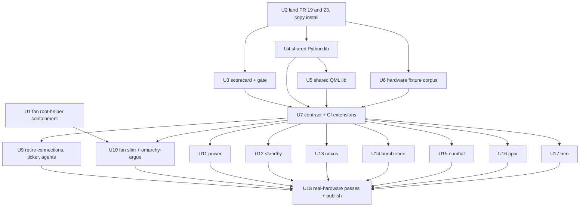
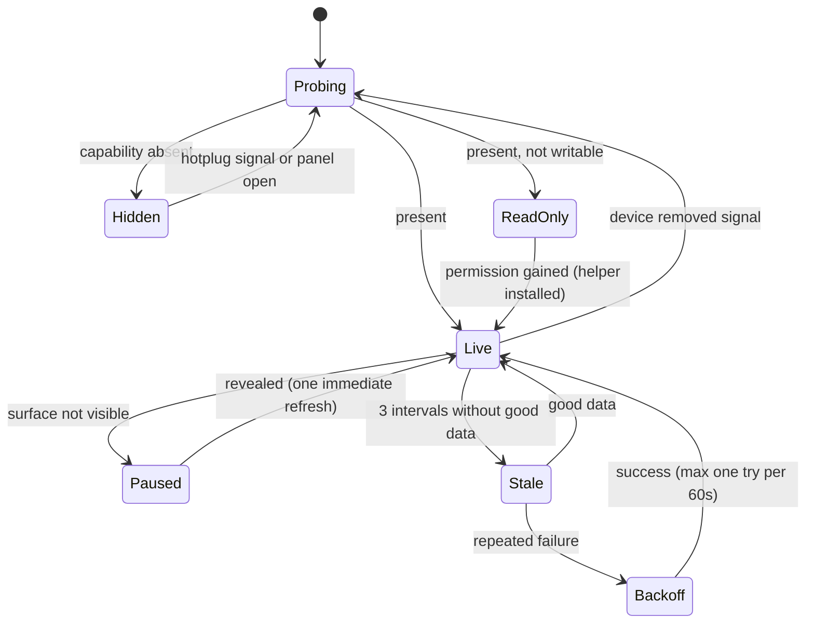
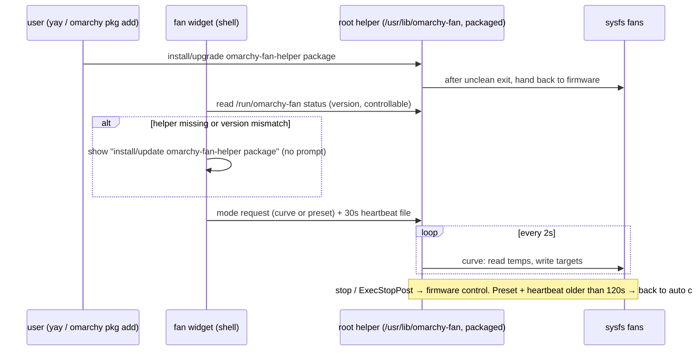

# Plugin Estate 11/10 - Plan

---

## Goal Capsule

- **Objective:** On both the M1 Max (Asahi, aarch64) and an x86_64 Dell, every custom plugin left on the bar shows correct data or an honest "not available here" state, costs close to nothing while nobody is looking at it, and never lets user-writable code run as root; plugins that a better existing tool already covers are replaced by that tool.
- **Means:** land the open PRs, fix the root-helper exposure, build one vendored shared library plus a hardware fixture corpus and a scorecard gate (KTD1, KTD3, KTD4), then run per-plugin tracks against that scorecard, retiring or slimming plugins per the lineup decisions (KTD6–KTD9).
- **Authority:** this plan's R-IDs win on product behavior; KTDs win on mechanism; `docs/PLUGIN_CONTRACT.md` stays the security contract and is extended, not replaced. Repo `AGENTS.md` rules hold (theme via `qs.Commons` only, helpers in `plugins/<id>/bin/`, never edit `/usr/share/omarchy/`).
- **Execution profile:** multi-PR program, one PR per unit or small unit cluster, merged in phase order. U1 ships first and alone.
- **Stop conditions:** stop and ask if (a) the host's behavior on a removed-but-still-placed plugin id corrupts the bar layout (U9), (b) `diegopluna/omarchy-argus` fails the third-party review in U10, (c) any fan write path cannot guarantee restore-to-auto (U1, U10), or (d) Quickshell `clearEnvironment` null semantics differ from the assumption in U5.
- **Who finishes:** an implementing agent via `ce-work`, with the user running the two real-hardware passes (Asahi live bar, Dell x86_64) in U18 and approving each publish.

---

## Product Contract

### Summary

Raise the estate in `plugins/` to a measurable "11/10" on product, engineering, performance, and multi-architecture support. Three plugins retire in favour of tools the user already runs, `fan` shrinks to fan control while a vetted third-party monitor takes over system monitoring, `power` absorbs the best ideas from marketplace battery plugins, and every surviving plugin is rebuilt on a shared, fixture-tested foundation with a per-plugin scorecard as the definition of done.

### Problem Frame

The estate grew plugin by plugin. The September JEV review (`docs/reviews/SUMMARY.md`) scored most plugins SHIP-WITH-FIXES, and the October research found more:

- **Security.** The root `omarchy-fan-daemon.service` executes `plugins/lukedaduke.fan/bin/omarchy-fan-daemon` straight from this git checkout (verified live), so any user-level process or a branch switch gets persistent root.
- **Cost.** Idle, panel-closed spawn rates run about 180/min for fan on Asahi (200+ on x86 with `nvidia-smi`/`dmidecode`), about 80/min for nexus behind a static icon, and about 16/min for numbat. pplx reads an omaseal secret every 30 s. Only standby and connections are already at zero.
- **Portability.** power hard-codes battery names, loses its watts graph without `power_now`, and exposes Apple-only fields as nulls on x86. fan offers controls for read-only Dell fans and its daemon fights power-profiles-daemon over `platform_profile`. neo shows a permanent red DOWN on any machine without the sidecar.
- **Duplication.** Copy-pasted helper code (`_run` ×8, atomic publish ×8, three divergent hwmon readers, nine `pluginRoot` resolvers, inconsistent env allowlists) means each fix lands once and drifts everywhere else.
- **Redundancy.** connections, ticker and agents duplicate first-party panels or third-party plugins the user already runs, and fan's monitoring half is beaten by `diegopluna/omarchy-argus`.
- **Unmerged work.** Most estate tooling (contract, release-readiness, data-lifecycle and host-integration checkers) exists only on draft PR #19, whose CI is red.

### Key Decisions

- **Retire connections, ticker and agents.** First-party Bluetooth/Network panels, `mohamedmansour.finance`, and `akitaonrails.ai-usagebar` (all already installed) cover them. Governs R17, R18. (session-settled: user-directed — chosen over keeping connections on a maintenance track: they are fully covered.)
- **fan becomes fan-control-only; `diegopluna/omarchy-argus` takes system monitoring.** No marketplace plugin controls Apple Silicon fans, while omarchy-argus has the better monitor (gated sampling, history ring, Asahi fixture, no root). Governs R19, R20. (session-settled: user-directed — chosen over keeping one all-in-one plugin rebuilt on omarchy-argus's patterns, and over upstreaming fan control into omarchy-argus.)
- **power keeps its unique core and adopts marketplace ideas.** It keeps the charge/watts graph, /proc consumers and macsmc specifics, adds history and health ideas from `omarchy-battery-insights` and a UPower charge-limit toggle from `omarchy-battery-health`, and drops its profile picker in favour of the first-party Power panel. Governs R21, R22. (session-settled: user-directed — chosen over adopting battery-insights wholesale.)
- **standby keeps its overlay and hands caffeine to first-party stay-awake.** Governs R23. (session-settled: user-directed — chosen over building timed holds ourselves.)
- **"11/10" is a written scorecard with pass/fail checks, not a taste rating.** Governs R1. (session-settled: user-approved — chosen over subjective per-plugin scores.)

### Requirements

**Definition of done**

- R1. Each surviving plugin has a scorecard in `docs/reviews/<id>.md` covering product, engineering, performance and multi-arch criteria (KTD3), and a plugin counts as 11/10 only when every criterion passes.
- R2. The estate CI fails when any surviving plugin's scorecard has a failing machine-checkable criterion.

**Security**

- R3. No root-executed file is writable by the user, including at install time: the fan helper reaches root only through a locally built pacman package, and the plugin never asks for root to run files from its own folder.
- R4. Whenever the fan helper stops, crashes, or is removed, the fans return to firmware control; fixed presets also revert when the shell itself is gone; and the helper never writes `platform_profile`.
- R5. Secrets are read from omaseal only at the moment of use, never on a poll; a locked or missing secret shows a single actionable "locked" or "setup" state without retry storms.

**Performance**

- R6. With every panel closed and the machine idle, the estate's surviving bar plugins together spawn no more than 10 processes per minute (baseline about 290), and each plugin individually stays within its scorecard budget.
- R7. Polling stops while the plugin's surface is not visible (panel closed and bar data not shown, session locked, or all outputs off), and one refresh fires on reveal; headless `service` kinds are exempt but carry their own budget.
- R8. Data older than three refresh intervals is labelled stale with its age rather than shown as current, and a failing helper backs off to at most one attempt per 60 s.

**Multi-architecture and hardware**

- R9. Every hardware-reading plugin runs on aarch64 Asahi and x86_64 (Intel or AMD, with or without NVIDIA), choosing what to show from what the machine exposes rather than from the architecture name.
- R10. Absent hardware hides its segment (no battery, no discrete GPU, no fans, no Bluetooth), present-but-read-only hardware shows values without controls, and nothing renders a permanent error for a capability the machine simply lacks.
- R11. Hardware changes (dock/undock, eGPU, battery or Bluetooth adapter appearing or disappearing, hwmon renumbering) are picked up without restarting the shell.

**Engineering quality**

- R12. Shared helper behavior (process execution with deadlines, atomic state writes, capped reads, text cleaning, the JSON envelope, sysfs readers) exists once in a vendored library whose copies CI proves identical to the source.
- R13. Every helper emits one versioned JSON envelope with `ok`, `error`, `data` and `capabilities`, and every panel handles all three outcomes.
- R14. Every open High/Medium review finding is fixed, and every advertised feature either works or is removed from README and manifest.
- R15. Every helper and capability path has tests that run against the hardware fixture corpus on both CI architectures.
- R16. Plugins publish to their standalone repos only through the release gate, and a publish never deletes files the remote has that the umbrella lacks without an explicit override.

**Lineup**

- R17. connections, ticker and agents are removed from the bar layout, `catalog.json`, `scripts/publish.sh` and `machine/plugins.json`, with their replacement already placed, and their standalone repos ship a final release that points to the replacement before being archived.
- R18. On machines managed by this repo's migration tooling, a retired plugin is replaced by its successor with a working bar, and rollback restores it. Any other install keeps a working bar and sees a notice naming the replacement and how to install it.
- R19. `diegopluna/omarchy-argus`, pinned to a reviewed commit that routine plugin updates cannot move, is the bar's system monitor on this machine and is recorded in `machine/plugins.json`.
- R20. `lukedaduke.fan` provides fan speed, target and mode control on Apple SMC and dell-smm hardware through the root helper, keeping the tuned silent `auto` curve and the user `custom` curve. It is read-only or hidden on other hardware, and it no longer shows RAM, CPU, GPU, disk or process data (the helper still reads temperatures to drive curves).
- R21. power shows battery, charge/watts history, consumers and health on any machine with a system battery, adds 7-day and 30-day history split into awake and sleep drain plus a health projection, and offers a charge-limit toggle wherever UPower reports support.
- R22. power no longer offers a power-profile picker.

**Per-plugin product**

- R23. standby's caffeine control reflects and toggles Omarchy's own stay-awake state, and the overlay covers the output it is opened on, burn-in safely.
- R24. nexus refreshes on hardware events and on panel open instead of a fixed timer, shows negotiated against baseline link speed, and carries no hard-coded personal device names.
- R25. bumblebee tracks the latest advisory catalog release, never runs two scans at once, and exposes its interval and auto-refresh settings.
- R26. numbat reads its Jev key from omaseal (importing an existing key file once on request), runs its review helper under the same deadline discipline as other helpers, and exposes its settings.
- R27. pplx can be summoned by keybind, never reads the key while idle, and exposes its result-limit setting.
- R28. neo is a local-only plugin, excluded from publishing, that hides itself where its sidecar units do not exist.

### Success Criteria

- The scorecard gate (R2) is green on both CI architectures for every surviving plugin.
- Idle panel-closed spawn measurement on the M1 Max shows no more than 10 per minute estate-wide (R6), recorded in each scorecard.
- On a real x86_64 Dell, every surviving plugin either shows data or hides cleanly, with no red error states, recorded as a dated real-hardware pass in each scorecard.
- `systemctl cat omarchy-fan-daemon.service` shows the package-owned unit, the daemon is owned by a pacman package, and a SIGKILL followed by restart hands fans back to firmware before the curve resumes.

### Scope Boundaries

- Plugins outside this repo (dayflow, omaseal, wisp, and the third-party plugins in `~/.config/omarchy/plugins`) are out of scope except for placing omarchy-argus and the existing replacements.
- No compiled helper rewrites (KTD2). Revisit only if U18 measurements show a single plugin over budget after gating and caching.
- No CVE-feed scanning in bumblebee. It stays a known-compromised-package radar, since arch-audit and cve-watcher cover CVEs.
- Considered and not built: a shared cross-plugin hardware snapshot daemon that fan and power would both read. Once fan stops collecting, no overlap is left to share. Revisit if a second hardware plugin appears.
- Considered and not built: an `architectures` field the host enforces. The host ignores unknown manifest keys, so an advisory field would only feed the release gate, which CI evidence already covers.
- Considered and not built: ThinkPad (`thinkpad_acpi`) fan control. Neither target machine has it, so the backend could only be checked against synthetic fixtures. ThinkPads get read-only RPM through the generic hwmon path. Revisit if a ThinkPad joins the fleet.
- Considered and not built: configurable neo units and ports. neo is local-only, so constants plus hide-when-absent meet R28, and neo's scorecard waives the x86_64 real-hardware item.

### Deferred to Follow-Up Work

- Upstream the Asahi fan-control backend to omarchy-argus as a PR once U10 has proven it locally.
- KEV-catalog badge for bumblebee.
- numbat timeline drill-down (plan 2026-10-01 item A4), unless it falls out of U15 cheaply.
- Marketplace re-listing and preview refresh for slimmed or renamed plugins.

### Outstanding Questions

**Resolve before the affected unit**

- Q1 (U9). What does the host do when a plugin id that is still placed on the bar disappears from the plugins directory? U9 starts by testing this on a scratch config; the stub-release design assumes "logs and skips".
- Q2 (U11), resolved. The 75/80 limit is persisted by asahi-scripts: the package-owned udev rule `93-macsmc-battery-charge-control.rules` plus `macsmc-battery-charge-control-end-threshold.{path,service}`, which save whatever value is written. No `battery-charge-limit.service` exists. UPower is the only control surface and the asahi-scripts layer stays. The gap is display: UPower reports `ChargeThresholdEnabled=false` while sysfs already holds 75/80, so U11 syncs UPower once, on user confirmation.

**Deferred to implementation**

- The exact qmllint binary path on Arch and on Ubuntu runners.
- Whether `fanN_target` writes on macsmc are honored with `fan_control` off, which decides whether the Asahi backend needs the module parameter flipped.
- Whether asahi DRM exposes fdinfo GPU busy time. This no longer matters to fan, but is worth noting for omarchy-argus.

### Sources & Research

- Research dossiers (session scratch, not committed): repo audit with per-plugin spawn measurements; marketplace head-to-head across about 38 competitor plugins via the marketplace `registry.json`; multi-arch hardware best practices with live probes of this machine; spec-flow edge-case analysis.
- Live probes on the M1 Max: `macsmc_hwmon` exposes `fanN_{input,min,max,target}`, no `pwm*_enable`, no CPU/GPU temps; asahi DRM exposes no GPU telemetry; UPower 1.91.4 reports `ChargeThresholdSupported=true` on `macsmc-battery`; power-profiles-daemon lists only balanced and power-saver.
- First-party Omarchy: `/usr/share/omarchy/bin/omarchy-toggle-idle`, `omarchy-update-stay-awake`, `shell/plugins/services/idle/Service.qml`, `shell/plugins/bar/indicators/StayAwake.qml`; plugin validation in `bin/omarchy-plugin-validate` (no symlinks, no arch field, `activation` unread).
- Competitors adopted from: `diegopluna/omarchy-argus` (MIT; sampling service with slow-sensor tick divisor, persistent 2m/1h/24h history, fixture corpus), `aabulkhairov/omarchy-battery-insights` (24h/7d/30d awake vs sleep drain, health projection), `patcastle/omarchy-battery-health` (rootless UPower charge-limit toggle, hides when unsupported), Dock Doctor (udev wake, baseline vs negotiated speed).
- Prior plans: `docs/plans/2026-09-23-001-feat-active-plugin-estate-plan.md` (U4 fan control, U8 release gate left open), `docs/plans/2026-09-16-001-feat-perplexity-tool-plugins-plan.md` (U6 settings schemas never shipped), `docs/plans/2026-10-01-001-feat-numbat-bumblebee-neo-improvements-plan.md` (Jev untested).

---

## Planning Contract

### Key Technical Decisions

- KTD1. **Shared foundation first, then per-plugin tracks.** Fixing env hygiene, deadlines and atomic writes once in a library beats eleven independent passes that re-drift. (session-settled: user-approved — chosen over eleven independent plugin plans: the duplicated helper code is the main source of repeat findings.)
- KTD2. **Keep Python and bash helpers; win performance by gating and caching.** Measurements show spawn count dominates cost, not interpreter speed. A Python helper also stays architecture-neutral. (session-settled: user-approved — chosen over compiled Rust/Go rewrites: no profiling evidence justifies them.)
- KTD3. **The scorecard is a fixed checklist, half machine-checked.** Criteria: no open H/M findings; PlainText on all external text; every exec is deadline-paired with group kill and minimal env; helpers emit the R13 envelope; tests pass on the fixture corpus for every relevant hardware profile; idle panel-closed spawn budget met (measured locally, recorded with date); visibility gating present; stale and backoff behavior present; README claims match features; Asahi live pass and x86_64 Dell pass recorded with date. `scripts/check-scorecard.py` enforces the static items and the presence of the dated manual items.
- KTD4. **Vendored shared library with a version stamp and a drift check.** Each plugin publishes as its own repo and the host rejects symlinks, so `shared/` is the source and `scripts/sync-shared.py` copies it into `plugins/<id>/bin/_omplug/` (Python) and `plugins/<id>/lib/` (QML) with a `VERSION` file. CI fails on any difference from source, and the release gate re-checks the subtree-split output. Plugins may run different lib versions after a partial publish; no runtime state is shared across plugins unless its schema carries a version.
- KTD5. **Capability probing by file and driver presence, never by `uname -m` or DMI.** Every sysfs reader takes a `root` parameter so tests point it at fixture trees. Probes are cached per process and re-run on panel open, on D-Bus or udev signals where Quickshell already exposes them, and on a slow visible-only timer. hwmon is resolved by `name` plus label, never by index.
- KTD6. **Use event sources Quickshell already exposes before writing Python.** `Quickshell.Services.UPower` (already imported by power), plus the Bluetooth and networking services where present, replace polled shell pipelines such as the 16-exec `omarchy-battery-status` call.
- KTD7. **The fan helper is a packaged, versioned curve controller.** (session-settled: user-directed — chosen over a pkexec installer run from the plugin folder: that still lets user-level code swap what gets approved.)
  - **Packaging.** A PKGBUILD in this repo (`packaging/omarchy-fan-helper/`) installs the daemon to `/usr/lib/omarchy-fan/`, the unit, and an uninstall path, via `omarchy pkg add`/yay. The plugin only reads the helper's version and shows "update the omarchy-fan-helper package". It never calls pkexec.
  - **Behavior.** The daemon keeps the tuned silent `auto` curve and the `custom` curve, reading temperatures every 2 s and writing targets. (session-settled: user-directed — chosen over dropping the curves for firmware auto: the silent curve is in daily use.)
  - **Hand-back.** It returns control to firmware (macsmc `fan_control` module parameter off, dell `pwmN_enable=2`) on stop, via `ExecStopPost`, and on start after an unclean exit.
  - **Presets.** Fixed presets (not curves) expire when the shell heartbeat is older than 120 s. The heartbeat is a spawn-free FileView write from the fan widget every 30 s, exempt from VisibilityGate, so locking the screen or closing the panel never ends a preset.
  - **Files.** The daemon writes its status (version, mode, controllable) to `/run/omarchy-fan/` (systemd `RuntimeDirectory`, root-owned) and only reads from the user runtime directory.
  - **Profiles.** It stops writing `platform_profile`: power-profiles-daemon owns profiles, and the first-party Power panel is the single profile UI.
- KTD8. **Retirement goes through one stub release plus the existing surface-migration tooling.** `scripts/plan-surface-migration.py` and `scripts/apply-surface-migration.py` already do atomic, reversible layout changes, so they are extended to unplace a retired id and place its replacement. The retired plugin's final release renders a single "replaced by X" notice and nothing else.
- KTD9. **Adopt omarchy-argus by pinned commit after a contract review.** Third-party plugins run unsandboxed inside the shell process. U10 reviews the pinned source against `docs/PLUGIN_CONTRACT.md`, then installs it as a plain copy of that commit with no `.git`, so `omarchy plugin update` skips it. `machine/plugins.json` records the commit, and a re-pin script refuses any commit without a matching review entry.
- KTD10. **Visibility is one shared QML gate.** A plugin is visible when its panel is open, or its bar text is shown on any enabled output while the session is unlocked and at least one output is powered. Lid state is deliberately not an input, because output power already covers it and lid events are unreliable on Asahi. `service` kinds and spawn-free timers (such as the fan heartbeat) bypass the gate. Each plugin consumes the gate from the vendored QML lib instead of wiring its own timer conditions.
- KTD11. **Live install is a copy while the program runs.** Today `~/.config/omarchy/plugins/<id>` symlinks into this worktree, so branch switches and lib syncs break the running bar mid-session. U2 switches the live bar to `scripts/install.sh --copy` from `main`, and per-plugin dev testing uses `--link` from a dedicated worktree.

### High-Level Technical Design

Program shape and dependencies:



Capability lifecycle every hardware-reading plugin follows (R9–R11):



Fan helper lifecycle (R3, R4, KTD7):



Shared library layout (KTD4):

```text
shared/
  py/_omplug/        # run+deadline+group kill, tool lookup (one SAFE_PATH), atomic publish,
                     # capped read, clean_text, envelope, sysfs readers (hwmon, power_supply, drm)
  qml/               # PluginRoot (percent-decoded), ProcEnv, DeadlineProcess, VisibilityGate,
                     # StaleLabel, ToastStack (bumblebee + numbat)
  VERSION
plugins/<id>/bin/_omplug/   # vendored copy + VERSION (generated, committed)
plugins/<id>/lib/           # vendored QML copy (generated, committed)
tests/fixtures/hw/<profile>/sys/...   # asahi-m1max, dell-precision, amd-desktop,
                                      # nvidia-optimus, no-battery, empty
```

### Assumptions

- A Dell Precision (x86_64) running Omarchy is reachable for the U18 real-hardware pass. If not, the x86_64 criterion records CI-plus-fixture evidence and the scorecard marks the real-hardware item pending.
- `null` values under `clearEnvironment: true` in Quickshell unset the variable. U5 verifies this before vendoring; if wrong, ProcEnv builds an explicit allowlist with no nulls.
- The marketplace treats an archived standalone repo as removable; the stub release covers existing installs either way.

### Risks & Mitigation

| Risk | Decision |
|---|---|
| Root exposure persists until U1 ships | U1 goes first and alone, with no dependency on foundation work. |
| A third-party plugin (omarchy-argus) runs unsandboxed in the shell | Review a pinned commit before install, and re-review on every pin bump (KTD9). |
| Fans left at a manual target after a crash | Firmware hand-back on start after an unclean exit and in ExecStopPost, plus preset expiry (KTD7); verified with SIGKILL in U1. |
| The charge-limit toggle shows "off" while the 80% limit is actually enforced | One-time UPower sync on confirmation, and the asahi-scripts persistence stays (Q2). |
| The idle-cost measurement under-counts | Root-scoped execve tracer, because unprivileged tracing is blocked by `ptrace_scope=1` (U7). |
| Retiring a placed plugin breaks the bar layout | Test host behavior first (Q1); migration is atomic and reversible (KTD8). |
| Lib skew across independently published plugins | `VERSION` stamp, drift check on the split output, no unversioned shared runtime state (KTD4). |
| Branch work breaks the running bar | Copy-mode live install from `main` (KTD11). |
| Subtree publish deletes remote-only files (the Jev erasure precedent) | Dry-run diff refuses deletes without `--allow-delete` (U4). |
| No real x86_64 machine available | Fixture plus CI evidence, with the real-hardware item marked pending (first Assumption). |

### System-Wide Impact

- **Bar layout and settings:** U9 and U10 change `machine/bar-layout.json` and the placed set; fan keeps its id so `shell.json` mode settings survive.
- **System services:** U1 replaces a hand-installed root unit with a packaged one. U11 drives the asahi-scripts charge-limit through UPower without replacing it. U12 changes who owns idle inhibition.
- **Standalone repos:** three archived, one (neo) delisted, the rest republished through the stronger gate.
- **Global machine profile:** the user's machine profile names a nonexistent `battery-charge-limit.service` and describes the old fan daemon. Correct both when U1 and U11 land.

### Sequencing

U1 ships first and alone, because the root exposure exists today. U2 follows to turn CI green and stop branch switches from changing the live bar. The foundation units (U3–U7) come next and can partly run in parallel. Per-plugin units (U9–U17) are independent of each other once U7 lands. U18 closes the program.

---

## Implementation Units

| U-ID | Title | Key files | Depends on |
|---|---|---|---|
| U1 | Fan root-helper containment | `packaging/omarchy-fan-helper/`, `plugins/lukedaduke.fan/bin/omarchy-fan-daemon` | — |
| U2 | Land PR #19 and #23, copy-mode live install | `scripts/check-plugin-contract.py`, `tests/test_power.py`, `plugins/io.github.duketopceo.neo/LICENSE`, `scripts/install.sh` | — |
| U3 | Scorecard and gate | `docs/SCORECARD.md`, `scripts/check-scorecard.py`, `docs/reviews/*.md` | U2 |
| U4 | Shared Python library and sync | `shared/py/_omplug/`, `scripts/sync-shared.py`, `scripts/publish.sh` | U2 |
| U5 | Shared QML library | `shared/qml/*.qml` | U4 |
| U6 | Hardware fixture corpus | `tests/fixtures/hw/`, `scripts/capture-hw-fixture.py` | U2 |
| U7 | Contract checker and CI extensions | `scripts/check-plugin-contract.py`, `.github/workflows/ci.yml`, `scripts/measure-plugin-cost.py` | U3, U4, U5, U6 |
| U9 | Retire connections, ticker, agents | `scripts/*-surface-migration.py`, `catalog.json`, `machine/plugins.json` | U7 |
| U10 | fan slim + adopt omarchy-argus | `plugins/lukedaduke.fan/` | U1, U7 |
| U11 | power track | `plugins/lukedaduke.power/` | U7 |
| U12 | standby track | `plugins/lukedaduke.standby/` | U7 |
| U13 | nexus track | `plugins/lukedaduke.nexus/` | U7 |
| U14 | bumblebee track | `plugins/io.github.duketopceo.bumblebee/` | U7 |
| U15 | numbat track | `plugins/io.github.duketopceo.numbat/` | U7 |
| U16 | pplx track | `plugins/io.github.duketopceo.pplx/` | U7 |
| U17 | neo local-only track | `plugins/io.github.duketopceo.neo/`, `scripts/publish.sh` | U7 |
| U18 | Real-hardware passes and publish | `docs/reviews/*.md`, `docs/reviews/SUMMARY.md` | U9–U17 |

(U8 was folded into U2; the gap is intentional.)

### U1. Fan root-helper containment

- **Goal:** Close the root-exec exposure and make fan writes fail safe, before anything else changes.
- **Requirements:** R3, R4; KTD7.
- **Dependencies:** none.
- **Files:** new `packaging/omarchy-fan-helper/PKGBUILD` (+ `.install` hooks), `plugins/lukedaduke.fan/bin/omarchy-fan-daemon` (packaged source), `plugins/lukedaduke.fan/omarchy-fan-daemon.service` (moves under `packaging/`), `plugins/lukedaduke.fan/bin/omarchy-fan-daemon-start` (removed), `plugins/lukedaduke.fan/Panel.qml`, `tests/test_fan_stats.py`, new `tests/test_fan_helper_package.py`.
- **Approach:**
  1. Build the package so it installs the daemon to `/usr/lib/omarchy-fan/` and the unit with `RuntimeDirectory=omarchy-fan` and `ExecStopPost` hand-back. Its install hook disables and removes any hand-installed `/etc/systemd/system/omarchy-fan-daemon.service` whose `ExecStart` is under a user-owned path. The user installs it via `omarchy pkg add`/yay (CLAUDE.md rule: never raw `makepkg`).
  2. The daemon writes version, mode and controllable to `/run/omarchy-fan/status.json` and never opens anything under `/run/user` for writing. The panel compares the version with the bundled expectation and shows a package-update hint. Every pkexec call is removed from the plugin.
  3. Keep the `auto` and `custom` curves (KTD7). Hand back to firmware on start after an unclean exit and in `ExecStopPost`. Expire fixed presets (not curves) on a heartbeat older than 120 s. Drop all `platform_profile` writes. Gate control on `fan*_target`/`pwm*` writability, not existence.
  4. The fan widget writes the heartbeat through a spawn-free FileView every 30 s, outside VisibilityGate.
  5. Package removal stops the unit and hands back to firmware.
- **Execution note:** Add characterization tests around the daemon's current curve and write paths against fixture trees before changing them, including the `/sys/module/macsmc_hwmon/parameters/fan_control` parameter.
- **Patterns to follow:** curve and smoothing code already in `omarchy-fan-daemon` (`AUTO_CURVE`, `curve_pwm`, `FanSmoother`); descriptor-relative I/O in the bumblebee/numbat helpers.
- **Test scenarios:**
  - The package's install hook, given a hand-installed unit whose `ExecStart` is under `/home/...`, disables it and reports it replaced.
  - `Panel.qml` and the plugin `bin/` contain no `pkexec` invocation (static assertion).
  - A daemon start after an unclean-exit marker, on the macsmc fixture with `fan_control=Y`, hands back (`fan_control=N`) before resuming the selected curve.
  - SIGTERM hands back on the macsmc fixture (module parameter) and the dell fixture (`pwm1_enable=2`).
  - The `auto` curve at 35 °C on the macsmc fixture writes the curve's floor target, and at 70 °C writes the smoothed ramp value.
  - A fixed preset with a 150 s-old heartbeat reverts to the `auto` curve.
  - The `auto` curve with a stale heartbeat keeps running.
  - A locked session with the shell alive keeps a preset, because the heartbeat continues.
  - A dell_smm fixture with read-only `pwm1` reports `controllable: false`, and the panel shows no mode buttons.
  - No code path writes `/sys/firmware/acpi/platform_profile`.
  - The daemon never opens a path under `/run/user` for writing.
- **Verification:** `systemctl cat omarchy-fan-daemon.service` shows a package-owned unit with `ExecStart` under `/usr/lib/omarchy-fan/`, `pacman -Qo` owns the daemon, and `kill -9` followed by restart hands fans back to firmware before the curve resumes.

### U2. Land PR #19 and #23, copy-mode live install

- **Goal:** Get the existing estate tooling onto `main` with green CI, and decouple the running bar from branch work.
- **Requirements:** KTD11. This unit is the baseline that R2 (built in U3) and R16 (built in U4) depend on.
- **Dependencies:** none (can run parallel to U1).
- **Files:** `scripts/check-plugin-contract.py`, `tests/test_plugin_contract.py`, `tests/test_power.py`, `plugins/io.github.duketopceo.neo/LICENSE`, `scripts/install.sh`, `machine/RESTORE.md`.
- **Approach:**
  1. Add a loopback exemption (`127.0.0.1` and `::1` only) to the https-only rule.
  2. Add the neo LICENSE.
  3. Update the six stale power tests to the current behavior (/proc consumer scan, 1440-entry cap), since the implementation is the intended design.
  4. Merge PR #23, then PR #19 (it already contains #23's commit).
  5. Switch the live bar to `install.sh --copy` from `main`, and document `--link` from a dev worktree for testing.
- **Patterns to follow:** existing checker rule tables in `scripts/check-plugin-contract.py`.
- **Test scenarios:**
  - `http://127.0.0.1:9211` and `http://[::1]:9211` pass the https-only rule.
  - `http://localhost.evil.com` and `http://10.0.0.1` still fail it.
  - The power consumer scan test drives the `dirfd` /proc path with a fixture /proc tree.
  - The history-cap test asserts 1440 retained entries.
- **Verification:** CI is green on both runners for `main` after the merges, and `~/.config/omarchy/plugins/<id>` entries are real directories, not symlinks into the worktree.

### U3. Scorecard and gate

- **Goal:** Make "11/10" a checkable artifact per plugin.
- **Requirements:** R1, R2; KTD3.
- **Dependencies:** U2.
- **Files:** new `docs/SCORECARD.md`, new `scripts/check-scorecard.py`, new `tests/test_scorecard.py`, `docs/reviews/<id>.md` for each surviving plugin, `docs/reviews/SUMMARY.md`.
- **Approach:** `docs/SCORECARD.md` owns the criteria list (KTD3) and the per-plugin spawn budgets. Each review file gains a machine-readable scorecard block. The checker validates static criteria by calling the contract checker and the tests, and requires dated entries for the manual criteria (spawn measurement, Asahi pass, x86 pass). Missing or undated manual entries are reported as "pending", which fails only in `--release` mode. A `retiring` list (connections, ticker, agents) exempts those ids until U9 removes them; a `retiring` id still in `catalog.json` fails `--release`. Per-plugin waivers (neo's x86_64 item) live in the same file.
- **Test scenarios:**
  - A `retiring` id with no scorecard reports "retiring" and passes default mode.
  - A scorecard with every item passing and dated returns exit 0.
  - A missing x86 pass date returns "pending", passes default mode and fails `--release`.
  - A plugin directory without a scorecard block fails.
  - A retired plugin id listed in `catalog.json` but with no scorecard fails, which catches incomplete retirement.
- **Verification:** the gate runs in CI and reports every surviving plugin as pending, not failing, before the per-plugin tracks begin.

### U4. Shared Python library and sync

- **Goal:** One implementation of the helper primitives, vendored into each plugin with proven equality.
- **Requirements:** R12, R13, R16; KTD4, KTD5.
- **Dependencies:** U2.
- **Files:** new `shared/py/_omplug/{proc,fsio,text,envelope,sysfs}.py`, new `shared/VERSION`, new `scripts/sync-shared.py`, `scripts/publish.sh`, `scripts/check-release-readiness.py`, new `tests/test_omplug.py`, new `tests/test_sync_shared.py`.
- **Approach:**
  1. Consolidate `_run`/`_kill_tree`, the fixed-path tool lookup with one `SAFE_PATH`, atomic publish, `_read_capped`, `clean_text`, and the envelope. Add sysfs readers that take `root`.
  2. The sync script writes copies plus `VERSION` and is atomic per plugin (stage, then rename), so a half-synced tree never exists.
  3. The release gate re-checks the subtree-split output against `shared/`.
  4. `publish.sh` gains a dry-run diff that refuses when the remote has files the split would delete, unless `--allow-delete` is passed (R16).
  5. Plugins migrate to the library inside their own units, not here.
- **Patterns to follow:** the hardened bumblebee/numbat helpers for the security posture; pick the strictest variant wherever copies differ.
- **Test scenarios:**
  - `run` kills the whole process group at the deadline, leaving no grandchild alive.
  - `run` truncates output at `max_bytes` and reports truncation.
  - Atomic publish refuses a symlinked target directory and writes mode 0600.
  - `clean_text` strips C0/C1 controls and clips to length.
  - The sysfs hwmon reader resolves sensors by name plus label when indices differ between two fixture trees.
  - The sysfs hwmon reader keeps two same-named devices distinct (two `nvme` sensors).
  - The envelope always carries `schema`, `ok`, `error`, `data` and `capabilities`, even on exception.
  - The sync drift check fails when one vendored file differs by one byte.
  - `publish.sh` dry-run reports a remote-only file and refuses without `--allow-delete`.
- **Verification:** `scripts/sync-shared.py --check` passes in CI, and every helper's envelope tests pass on both runners.

### U5. Shared QML library

- **Goal:** One implementation of the panel-side primitives.
- **Requirements:** R7, R8, R12; KTD10.
- **Dependencies:** U4 (shares sync and `VERSION`).
- **Files:** new `shared/qml/{PluginRoot,ProcEnv,DeadlineProcess,VisibilityGate,StaleLabel,ToastStack}.qml`, `scripts/sync-shared.py`, new `tests/test_shared_qml.py`.
- **Approach:**
  1. Percent-decode `pluginRoot`.
  2. ProcEnv is one allowlist that keeps `XDG_RUNTIME_DIR` (fan's past breakage) and drops secrets.
  3. DeadlineProcess pairs the kill timer with the helper alarm and group-kills.
  4. VisibilityGate implements KTD10 from Quickshell session-lock and output power state.
  5. StaleLabel implements R8.
  6. ToastStack is lifted from bumblebee's `Service.qml` with numbat's divergences reconciled.
- **Execution note:** First verify in a live Quickshell how `null` under `clearEnvironment` behaves (Assumption 2), and record the result in the file header.
- **Test scenarios:**
  - `pluginRoot` with `%20` in the path resolves to the decoded path.
  - The ProcEnv output contains `XDG_RUNTIME_DIR` and `PATH`, and no `*_API_KEY`.
  - The DeadlineProcess kill timer is longer than the declared helper alarm (static check against each helper's alarm constant).
  - A smoke run of Quickshell offscreen with a fixture plugin shows VisibilityGate stopping the timer on panel close and firing one refresh on open.
  - StaleLabel shows "3m ago" after three missed 60 s intervals.
- **Verification:** `qmllint` is clean on all shared QML, and the offscreen smoke runs on both CI runners (or on Asahi locally if the runner lacks Quickshell, recorded as such).

### U6. Hardware fixture corpus

- **Goal:** Realistic sysfs trees for every hardware profile the plugins must support.
- **Requirements:** R9, R10, R15; KTD5.
- **Dependencies:** U2.
- **Files:** new `tests/fixtures/hw/{asahi-m1max,dell-precision,amd-desktop,nvidia-optimus,no-battery,empty}/`, new `scripts/capture-hw-fixture.py`, new `tests/test_fixtures_hw.py`.
- **Approach:** The capture script snapshots the relevant read-only sysfs subset into a fixture tree, redacting serials and MACs. That subset is hwmon names, labels and values; power_supply, including charge thresholds; drm; fan and pwm attributes with their modes; and `/sys/module/macsmc_hwmon/parameters/fan_control`. The Asahi profile is captured live. The Dell profile is captured on the Dell when reachable, otherwise authored from driver docs and marked synthetic. The capture script never reads `typec` `identity/*`, which Oopses this kernel.
- **Test scenarios:**
  - The capture script excludes `/sys/class/typec/*/identity`.
  - The capture script redacts `serial_number` and MAC addresses.
  - Each fixture has a manifest naming its source (live or synthetic) and capture date.
  - Each fixture loads under every `_omplug.sysfs` reader without exceptions.
- **Verification:** the fixtures are committed and used by at least one test per profile.

### U7. Contract checker and CI extensions

- **Goal:** Enforce the new rules mechanically on both architectures.
- **Requirements:** R2, R6, R7, R12, R15.
- **Dependencies:** U3, U4, U5, U6.
- **Files:** `scripts/check-plugin-contract.py`, `.github/workflows/ci.yml`, new `scripts/measure-plugin-cost.py`, `tests/test_plugin_contract.py`, `scripts/check-host-integration.py`.
- **Approach:**
  1. New contract rules: every non-service `Timer` that triggers a `Process` must be bound to VisibilityGate; DeadlineProcess must wrap every `Process`; `execDetached` must pass ProcEnv; every helper must set an alarm; no `omarchy.*` IPC targets.
  2. CI adds qmllint, shellcheck, ruff, the scorecard gate and the sync check on both runners.
  3. The cost script runs locally only. It traces `execve` under the live shell for a fixed idle window with a root-scoped tracer (`strace -f -e trace=execve -p <shell-pid>` under sudo via the omaseal pattern), because `ptrace_scope=1` blocks unprivileged tracing and /proc sampling misses short helpers. It attributes each exec to a plugin by helper path and writes the results into the scorecard.
  4. The host-integration checker stops expecting `hyprmoncfgd.service`, which is now unmanaged.
- **Test scenarios:**
  - An ungated Timer with an exec triggers a contract error.
  - The same Timer bound to the gate passes.
  - `execDetached` without ProcEnv triggers an error.
  - A helper without `signal.alarm` triggers an error.
  - The cost script, given a fixture strace execve log, computes the expected spawns per minute per plugin.
  - Execs under a non-plugin path are attributed to "other", not dropped.
- **Verification:** CI is green on both runners with the new rules enabled in warning mode. They flip to strict per plugin as each track lands.

### U9. Retire connections, ticker, agents

- **Goal:** Remove the three fully-covered plugins without breaking any bar.
- **Requirements:** R17, R18; KTD8.
- **Dependencies:** U7.
- **Files:** `scripts/plan-surface-migration.py`, `scripts/apply-surface-migration.py`, `tests/test_surface_migration.py`, `tests/test_apply_surface_migration.py`, `catalog.json`, `scripts/publish.sh`, `machine/plugins.json`, `machine/bar-layout.json`, `README.md`, `plugins/lukedaduke.{connections,ticker,agents}/`.
- **Approach:**
  1. Resolve Q1 on a scratch config first.
  2. Extend the migration planner with a retire action that unplaces an id and places its replacement: connections becomes the first-party Bluetooth and Network indicators, ticker becomes `mohamedmansour.finance`, and agents becomes `akitaonrails.ai-usagebar`. Apply and rollback stay atomic.
  3. Publish each plugin's final stub release (a manifest and bar widget whose only content is a "replaced by X" notice), then archive the three standalone repos.
  4. Delete the plugin directories one release later.
- **Test scenarios:**
  - Planning a retire of connections on a layout that contains it yields remove-connections plus add-first-party-indicators.
  - Retiring on a layout without the id is a no-op.
  - Retiring when the replacement is already placed only removes, with no duplicate replacement.
  - Rollback restores the exact prior layout bytes.
  - `check-scorecard.py` and `check-release-readiness.py` no longer list the retired ids after the catalog change.
- **Verification:** the live bar shows the replacements, the shell logs no plugin-load errors, and the three repos are archived with the stub as the latest release.

### U10. fan slim + adopt omarchy-argus

- **Goal:** fan becomes a small fan-control plugin, and omarchy-argus takes system monitoring.
- **Requirements:** R19, R20, R6, R9, R10; KTD7, KTD9.
- **Dependencies:** U1, U7.
- **Files:** `plugins/lukedaduke.fan/{Panel.qml,manifest.json,README.md}`, `plugins/lukedaduke.fan/bin/system_monitor_stats.py` (replaced by a small `fan_status.py` on `_omplug`), `plugins/lukedaduke.fan/bin/kill_proc.py` (removed), `machine/plugins.json`, `machine/bar-layout.json`, `tests/test_fan_stats.py` (renamed `tests/test_fan.py`), new `docs/reviews/third-party-omarchy-argus.md`.
- **Approach:**
  1. Review omarchy-argus at a pinned commit against `docs/PLUGIN_CONTRACT.md`. Measure its idle panel-closed spawn rate with the cost script and record both.
  2. Install it as a plain copy with no `.git` (KTD9), add the re-pin script, and place it on the bar.
  3. Strip RAM, CPU, GPU, disk, process and kill features from fan.
  4. The bar shows fan RPM and mode. The panel shows per-fan input, min, max and target plus `auto`, `custom` and preset modes. The macsmc and dell_smm backends are chosen by capability probe; other fans show read-only RPM.
  5. Keep the id `lukedaduke.fan` so saved mode settings carry over, and bump the major version.
- **Test scenarios:**
  - The asahi fixture shows two fans with RPM and mode buttons once the helper package reports a matching version.
  - The dell fixture with read-only pwm shows RPM only.
  - A generic hwmon fixture with `fan1_input` and no writable control shows read-only RPM.
  - The `empty` and `amd-desktop` (no fans) fixtures hide the bar widget content and run no timer.
  - An idle panel-closed tick spawns at most one process per minute, verified through the cost-script fixture.
  - The re-pin script refuses a commit with no matching review entry.
  - The README lists no monitoring features and documents the helper package.
- **Verification:** omarchy-argus is on the bar at its recorded commit and stays there after `omarchy plugin update --yes`. Its measured idle cost is recorded, fan's scorecard passes, and fan's idle spawn rate is within budget.

### U11. power track

- **Goal:** power works on any system battery and adds the adopted history and health features.
- **Requirements:** R21, R22, R5, R6, R8–R11, R13, R14; KTD6.
- **Dependencies:** U7.
- **Files:** `plugins/lukedaduke.power/{Panel.qml,Model.js,battery_helper.py,manifest.json,README.md}` (helper moves to `bin/`), `tests/test_power.py`, `tests/test_power_model.py`.
- **Approach:**
  1. Find batteries by `type==Battery, scope==System`. Fall back to V×I for watts.
  2. Hide the widget and skip the sampler when no system battery exists.
  3. Replace the `omarchy-battery-status` pipeline with `Quickshell.Services.UPower`.
  4. Move the 60 s history sampler into a new `service` entry point (manifest `kinds` gains `service`) with a budget of 1 spawn/min. The widget and panel only read history files.
  5. Keep the 1440-point raw history file unchanged. Add a versioned hourly rollup file (awake drain, sleep drain, capacity; 720 buckets for 30 days), written atomically as each hour rolls over. Classify sleep from logind `PrepareForSleep` and resume timestamps, not from sample gaps. The 7d/30d views and the capacity-trend health projection read the rollup.
  6. Add a charge-limit toggle through UPower where `ChargeThresholdSupported` is true. Its state comes from `ChargeThresholdEnabled`. On first use, after user confirmation, it calls `EnableChargeThreshold(true)` once so UPower matches the 75/80 thresholds already in sysfs (Q2).
  7. Remove the profile picker and the dead code, rename the `omarchy.power` IPC target, and add `defaultSection`.
- **Test scenarios:**
  - A dell fixture battery named `BAT1` with only `current_now`/`voltage_now` yields watts equal to V×I.
  - A fixture battery named `CMB0` is discovered.
  - The no-battery fixture yields `capabilities.battery=false` and no sampler.
  - Drain between a `PrepareForSleep(true)` and resume timestamp counts as sleep drain.
  - Drain during a locked session with outputs off counts as awake drain.
  - The hourly rollup survives restarts, rolls from the raw file without loss, and caps at 720 buckets.
  - The health projection with a flat capacity trend reports no projected date.
  - The charge-limit toggle is hidden when UPower reports unsupported.
  - With sysfs at 75/80 and `ChargeThresholdEnabled=false`, the toggle shows a "sync limit" prompt, not "off", and shows "on" after the sync.
  - The sampler service keeps sampling while the session is locked.
  - An existing pre-change history file loads without loss.
- **Verification:** the scorecard passes on the asahi and dell fixtures, the live panel shows history and the toggle on the M1 Max, and the open-panel spawn rate drops from about 110/min to within budget.

### U12. standby track

- **Goal:** Keep the nightstand overlay and drive caffeine through first-party stay-awake.
- **Requirements:** R23, R8, R14.
- **Dependencies:** U7.
- **Files:** `plugins/lukedaduke.standby/{Standby.qml,manifest.json,README.md}`, `plugins/lukedaduke.standby/bin/standby-data`, `tests/test_standby.py`.
- **Approach:**
  1. Read state from, and toggle through, the first-party idle service and `omarchy-toggle-idle`, replacing the `python3 -c` reimplementation.
  2. Open on the focused output.
  3. Add slow pixel shift for OLED burn-in safety.
  4. Render `feelsLike`, make location and refresh configurable, and document the ipapi.co fallback in the README.
  5. Sync `shell.hide` on close and toggle.
- **Test scenarios:**
  - When first-party stay-awake is on, the overlay shows caffeine on.
  - Toggling in the overlay flips the first-party state, and the overlay follows external toggles.
  - A weather payload with `feelsLike` renders it.
  - A configured location skips IP geolocation entirely.
  - The pixel-shift offset stays within its bounds over 24 simulated hours.
- **Verification:** the bar's StayAwake indicator and the overlay always agree, and the scorecard passes.

### U13. nexus track

- **Goal:** Event-driven topology radar with no personal hard-coding.
- **Requirements:** R24, R6, R7, R10, R11, R14.
- **Dependencies:** U7.
- **Files:** `plugins/lukedaduke.nexus/{Panel.qml,manifest.json,README.md}`, `plugins/lukedaduke.nexus/bin/probe_nexus.py`, `tests/test_probe_nexus.py`.
- **Approach:**
  1. Probe on panel open and on hotplug signals only, which removes the 3 s timer behind a static icon.
  2. Add negotiated against baseline speed, and complete the speed map.
  3. Move `KNOWN_HARDWARE` and the Bluetooth renames into settings with exact-match rules.
  4. Add per-section errors.
  5. Remove the "Internal Silicon" claim.
  6. Never read `typec` `identity/*`.
- **Test scenarios:**
  - Speed `1.5` maps to 1.5M, correcting the test that currently locks in 12M.
  - Speed `20000` maps to 20G.
  - A device name containing "pod" is not renamed unless an exact settings rule matches.
  - The Bluetooth section failing still renders the USB and storage sections, with that section showing an error.
  - The probe never opens a path matching `typec/*/identity`.
  - With the panel closed and no hotplug, no spawns occur.
- **Verification:** the idle spawn rate falls from about 80/min to 0, and the scorecard passes.

### U14. bumblebee track

- **Goal:** Current advisories, no concurrent scans, real settings.
- **Requirements:** R25, R7, R14.
- **Dependencies:** U7.
- **Files:** `plugins/io.github.duketopceo.bumblebee/{Panel.qml,Service.qml,LocalSettings.qml,manifest.json}`, `plugins/io.github.duketopceo.bumblebee/bin/{scan_bumblebee.py,refresh_catalog.py}`, `tests/test_bumblebee.py`.
- **Approach:**
  1. Resolve the latest release instead of the pinned `v0.1.2`, but accept only a tag that is semver-newer than the stored one. Skip the download when the tag is unchanged. Keep the existing schema and member checks. Refuse to merge a release that removes more than 5% of existing entries unless the user acts, keeping the prior catalog. Rewrite the integrity docstring in `refresh_catalog.py` to this boundary.
  2. Add a flock shared by Panel and Service scans and by the log append.
  3. Gate the panel poll.
  4. Ship the settings schema (`scanIntervalHours`, `autoCatalogRefresh`).
  5. Close the nine open review items.
  6. Use the shared ToastStack.
- **Test scenarios:**
  - Catalog refresh with an unchanged latest tag downloads nothing.
  - A newer tag triggers a download plus schema and member checks.
  - A "latest" tag older than the stored tag is refused.
  - A release that drops 20% of entries is held, and the prior catalog stays active.
  - A second scan started while one holds the lock exits "busy" without scanning.
  - Concurrent log appends lose no entries.
  - `scanIntervalHours=12` changes the service's scan cadence.
  - A merged catalog at MAX_ENTRIES stays within the read cap.
- **Verification:** the scorecard passes, and the catalog version shown in the panel matches the latest upstream release.

### U15. numbat track

- **Goal:** Lower cost, omaseal key, tested Jev.
- **Requirements:** R26, R5, R6, R7, R14.
- **Dependencies:** U7.
- **Files:** `plugins/io.github.duketopceo.numbat/{Panel.qml,Service.qml,LocalSettings.qml,manifest.json,README.md}`, `plugins/io.github.duketopceo.numbat/bin/{probe_numbat.py,jev_review.py}`, `tests/test_numbat.py`, new `tests/test_jev_review.py`.
- **Approach:**
  1. Gate the panel probe, and replace the 5 s tail stat with a FileView watch where Quickshell supports it.
  2. Read the Jev key through omaseal at review time only, with a one-time import from `~/.config/openrouter/keys.json` on user action, never deleting the old file.
  3. Run `jev_review.py` under `_omplug` deadlines with a stderr collector.
  4. Ship the settings schema and close the six open review items.
  5. Use the shared ToastStack.
- **Test scenarios:**
  - A Jev review with omaseal returning `agent_unauthorized` shows "locked", makes no retry, and sends no network call.
  - The key import copies the key into omaseal and leaves the source file untouched.
  - A Jev helper that exceeds its deadline is killed along with its children.
  - A future mtime on the findings file is clamped and not treated as fresh.
  - A failed hook status is not cached as an empty list.
  - With the panel closed and the agents idle, the Service does at most one spawn per minute.
- **Verification:** the idle spawn rate is within budget, the Jev tests pass, and the scorecard passes.

### U16. pplx track

- **Goal:** Zero idle secret reads, keybind summon, settings.
- **Requirements:** R27, R5, R7, R14.
- **Dependencies:** U7.
- **Files:** `plugins/io.github.duketopceo.pplx/{Panel.qml,manifest.json,README.md}`, `plugins/io.github.duketopceo.pplx/bin/{pplx_status.py,pplx_search.py}`, `tests/test_pplx.py`.
- **Approach:**
  1. The status poll checks key presence through omaseal metadata (list, no value) and only while visible.
  2. The key is read at search time only, and only from omaseal's value output, not its first stdout line.
  3. Add an IPC handler for a keybind summon.
  4. Ship the `resultLimit` setting.
  5. Keep `XDG_RUNTIME_DIR` via ProcEnv.
  6. Close the seven open review items.
- **Test scenarios:**
  - An idle status poll never invokes `omaseal get`.
  - A locked omaseal shows "locked" with an unlock hint and no retry within 60 s.
  - The IPC summon opens the panel with the input focused.
  - `resultLimit=3` caps the rendered results at 3.
  - History entries with control characters render cleaned.
- **Verification:** the omaseal access count for the perplexity key stays flat over an idle hour (`omaseal stats`), and the scorecard passes.

### U17. neo local-only track

- **Goal:** neo is honest on any machine and stays out of publishing.
- **Requirements:** R28, R7, R10, R14.
- **Dependencies:** U7.
- **Files:** `plugins/io.github.duketopceo.neo/{Panel.qml,manifest.json,README.md}`, `plugins/io.github.duketopceo.neo/bin/probe_neo.py`, `scripts/publish.sh`, `catalog.json`, `tests/test_neo.py`, new `docs/reviews/io.github.duketopceo.neo.md`.
- **Approach:**
  1. Mark neo local-only in `catalog.json` and remove it from the `publish.sh` mapping. Archive or privatize `duketopceo/omarchy-neo` after confirming with the user, since it is already listed on the marketplace.
  2. Keep the units and ports as constants in one place, deduplicating the `Panel.qml` endpoint.
  3. Hide neo when the units do not exist.
  4. Make the helper deadline shorter than the QML kill, fixing the 13 s worst case against the 12 s kill.
  5. Gate polling.
  6. Do neo's first JEV review.
- **Test scenarios:**
  - When `systemctl --user show` reports the units as not-found, the probe returns `capabilities.sidecar=false`, and the widget hides.
  - `Panel.qml` holds no hard-coded port and reads the endpoint from the helper.
  - The worst-case probe finishes before the QML deadline.
  - `publish.sh all` skips neo.
- **Verification:** on a machine without the sidecar the bar shows nothing for neo; on the M1 Max it shows live status; the scorecard passes.

### U18. Real-hardware passes and publish

- **Goal:** Prove the objective on real hardware and ship.
- **Requirements:** R1, R6, R9–R11, R16; Success Criteria.
- **Dependencies:** U9–U17.
- **Files:** `docs/reviews/*.md`, `docs/reviews/SUMMARY.md`, `catalog.json`, `README.md`.
- **Approach:**
  1. On the M1 Max: run the cost script with all panels closed for 10 minutes, then exercise dock/undock, Bluetooth off/on, lid close and suspend/resume, and record each result in the scorecards.
  2. On the Dell: install a copy, run the same pass, and capture a live `dell-precision` fixture to replace the synthetic one.
  3. Refresh `SUMMARY.md` as the new scoreboard.
  4. Publish each surviving plugin through the gate.
- **Test expectation:** none. This unit records evidence for the tests and gates other units built.
- **Verification:** `check-scorecard.py --release` passes for every surviving plugin, and each standalone repo's latest release matches `catalog.json`.

---

## Verification Contract

| Gate | Command | Applies to |
|---|---|---|
| Unit and fixture tests | `uv run --with pytest pytest -q` | every unit |
| Manifests | `python scripts/validate-manifests.py` (with `--release` before publish) | every unit touching a plugin |
| Contract | `python3 scripts/check-plugin-contract.py --strict` (per plugin once its track lands) | U2, U7, U10–U17 |
| Shared lib drift | `python3 scripts/sync-shared.py --check` | U4 onward |
| Scorecard | `python3 scripts/check-scorecard.py` (`--release` in U18) | U3 onward |
| Release readiness | `python3 scripts/check-release-readiness.py` | U2, U9, U18 |
| Host validator | `/usr/share/omarchy/bin/omarchy-plugin-validate plugins/<id>` | every plugin unit |
| QML lint | qmllint over `shared/qml` and changed plugin QML (path settled in U7) | U5, U7, U10–U17 |
| Idle cost | `python3 scripts/measure-plugin-cost.py` on the live M1 Max, all panels closed, 10 min | U10–U18; budget per `docs/SCORECARD.md`, estate ≤ 10 spawns/min |
| CI | `.github/workflows/ci.yml` matrix `ubuntu-latest` + `ubuntu-24.04-arm` green | every PR |

---

## Definition of Done

- Every surviving plugin (fan, power, standby, nexus, bumblebee, numbat, pplx, neo) passes `check-scorecard.py --release`, with a dated Asahi pass and a dated x86_64 pass (or an explicit pending entry if the Dell is unavailable, per the first Assumption).
- connections, ticker and agents are gone from the bar, catalog, publish map and `machine/plugins.json`, and their repos are archived behind a stub release.
- omarchy-argus is on the bar at a reviewed, pinned commit.
- The fan helper is installed from the local `omarchy-fan-helper` package and passes the SIGKILL hand-back check, with the silent `auto` curve still working.
- Estate idle cost is measured at or under 10 spawns per minute.
- Per unit: its tests pass on both CI runners, its contract rules are strict, and its README matches its features.
- Cleanup: no abandoned-attempt code, no unused helpers (the dead `_run`/`_kill_tree` copies in power are gone), and no generated artifacts are tracked. Stale docs (`docs/reviews/SUMMARY.md`, the 2026-10-01 plan's unchecked boxes, plugin ROADMAPs) are updated or removed.
